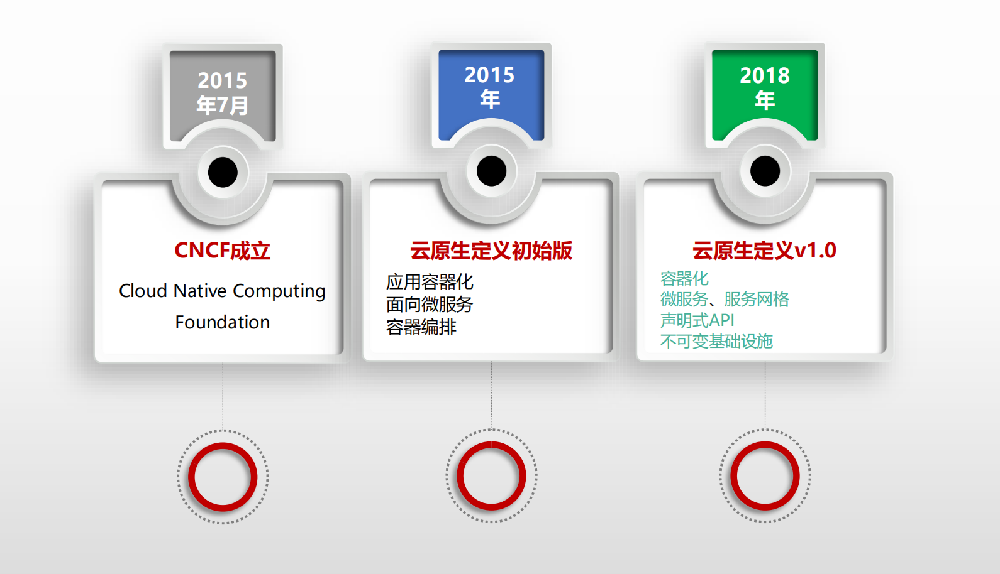

# PART1. 云原生的定义

## 1.1 企业数字化转型

这里我们重点关注这3个阶段之间的2次转变:

### 1.1.1 第一次转变

阶段一时,业务系统直接部署在裸服务器上,在裸服务器上装操作系统,在操作系统上装数据库、MQ、部署业务系统.这个阶段是**以设备为中心,组织基础设施和业务系统**.

阶段二时,云计算开始兴起,普遍做法实际上**就是把运行在裸服务器上的基础设施和业务系统,一比一地复刻到云环境中的虚拟机上.对于云环境的用户而言,就不再需要管理本地的交换机和路由器等设备了,直接使用云化的资源即可**.换言之,**对于基础硬件的维护工作,就托管给了云计算厂商**.

对于企业而言,减少了雇佣运维工程师和网络工程师的开销.这次转变使得企业可以将注意力集中在**软件系统**上.

### 1.1.2 第二次转变

阶段三时,由云化阶段转换到云原生阶段,其核心目标在于**云原生平台**,例如:

- 云原生基础设施:其实本质还是阶段二时期的各种云资源,但对于用户而言,不再需要过于关注这些资源.例如他们不需要再去关心到底有几台虚拟机、自己的资源该如何分配到各个应用等问题.这些问题都不再需要用户去手动解决."池化的云资源"这一概念仍旧存在,但需要关注它的只有厂商了,因为这些资源都以云原生基础设施平台的形式提供给了企业,企业只需要将应用部署到这个基础设施平台上即可.至于具体这个应用分配在哪台主机上最合适、这个应用应该分配给它多少资源等问题,也不需要再让企业去关心了,云原生基础设施平台会解决这个问题.

**这个阶段上,企业关心的既不是物理机也不是虚拟机,只关心需要部署的应用、应用之间的协同即可**.

如果想要达到这个目的,很自然地,需要在池化的云资源之上再提供一层,这一层负责统一治理底层的所有资源,而这一层就是容器平台的编排工具--K8S.

当然,为了更好的利用云端资源,企业也应当将自己的应用做微服务化构建,以便更好地适配云原生基础设施平台提供的弹性能力.

## 1.2 云计算的发展历程

以Docker的出现为边界,在Docker出现前称为传统云计算时期;在Docker出现后,称为新兴云计算时期.

## 1.3 Pivotal的定义

## 1.4 CNCF的定义

2018年,CNCF在关于云原生定义v1.0版本中这样描述云原生技术体系:

- 云原生技术有利于各组织在公有云、私有云和混合云等新型动态环境中,构建和运行可弹性扩展的应用
- 云原生的代表技术包括容器、服务网格、微服务、不可变基础设施和声明式API

云原生计算基金会(CNCF)致力于培育和维护一个厂商中立的开源生态系统,来推广云原生技术

那么,云原生究竟是什么?

- 12要素应用、微服务架构、自服务敏捷架构、基于API协作、反脆弱性
- 模块化、可观测、可部署、可测试、可处理、可替换
- DevOps、CD、微服务和容器化
- 容器、服务网格、微服务、不可变基础设施和声明式API