# PART2. 从Netflix的架构演进来理解云原生

## 2.1 Netflix

- 最初是一家以发行DVD为主营业务的公司
- 2007年将主营业务模式转变为在线租赁和视频站,以适应互联网化的大趋势
- 2008年起,公司即遇到了层出不穷的各类稳定性、扩容等问题
	- 2008年8月,Netflix主要数据库的故障导致了三天的停机
- 2009年后,流量激增下,这种问题更加严重

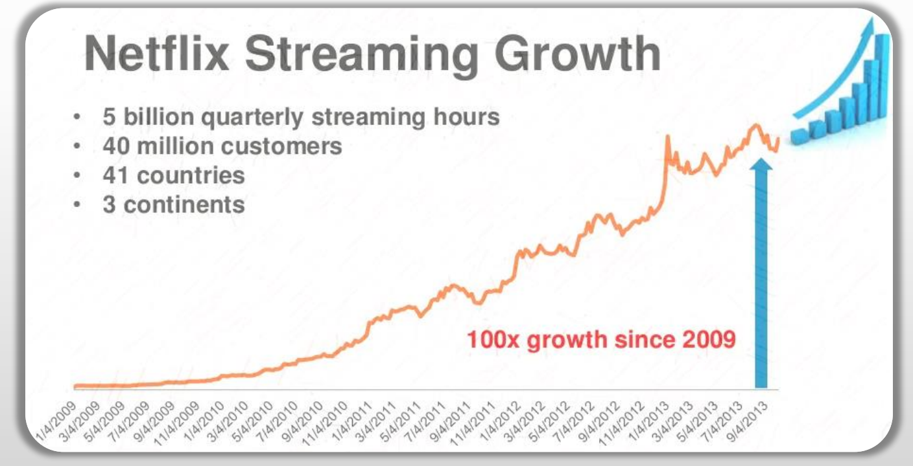

## 2.2 需要解决的问题

亟待解决的核心问题:扩容、性能、可用性

1. 如何按流量规模的增加完成快速扩容(Scalability)
2. 如何确保用户观看视频时性能体验较好(Performance)
3. 可用性(Availability)

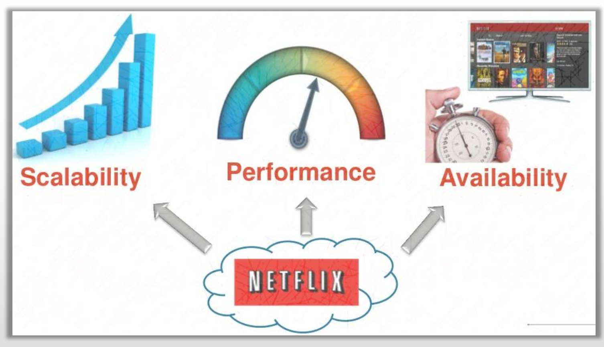

## 2.3 解决方案

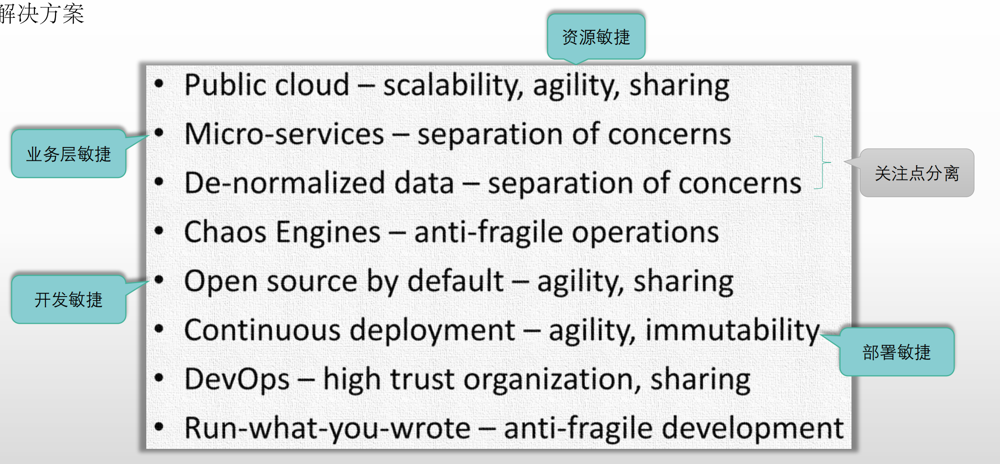

1. 全面上云(Public cloud):要想实现应用规模的扩展,走买服务器配置上架扩容系统这条路,其速度远远跟不上流量增速.当然主因是不够敏捷
2. 微服务化业务架构(Micro service):微服务化业务架构可以保证将故障隔离在一部分或极少量的服务中,从而让研发人员的组织架构也转变为多个开发小组.可以认为是业务层敏捷
3. 数据的非范式化(De-normailzed data):仍然是为了关注点分离.数据的变更(增删改操作)都会带来表的变更,这对于系统而言是极大的威胁.因此后续使用各种非关系型DB存储对事务要求不高的场景.其实除了交易和有交易特性的功能外,其他的功能对事务的要求都并不是很高.因此有了反范式的数据库设计.从ACID走向了BASE(基本可用、最终一致)
4. 混沌工程(Chaos Engines):由于微服务化,导致一个请求链上的任何一个微服务出现故障,都会导致请求失败.因此,需要使用混沌工程完成对于整个系统的反脆弱性测试
5. 尽可能使用开源软件(Open source by default):尽可能不自己造轮子
6. 持续部署(Continuous deployment):传统的发布过程,会分为很多个环境(研发环境/测试环境/预发布环境等),整个发布的过程会非常长.而持续部署从研发人员发出PR开始,整个应用就开始构建了,构建完成直接上线.当然,可能他发布的最新版有问题,所以还需要引入金丝雀发布的方式,进行在线测试
7. DevOps:为避免研发与运维的对立,因为持续部署的实现,因此研发人员自己就可以提交代码上线了.一般而言,服务发布后7天内出现故障,责任在研发而不在运维;而一周后才出现的问题,很有可能就是稳定性的问题了,这方面的问题属于运维工程师
8. Run-what-you-wrote:持续部署保证了PR即发版,因此运行的就是你写的代码

最终解决方案:上云

- 当时云计算市场并没有多大的选择空间,很容易想到,Netflix基本没有悬念地会选择AWS
- 2011年起,逐步将系统迁移到AWS上
- 节约了87%的成本

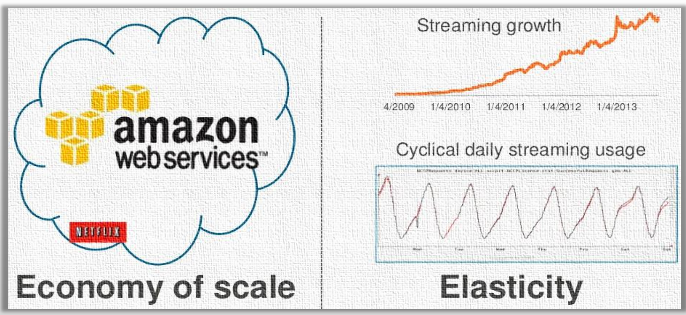

## 2.4 上云之后带来的问题

"上云"之后的艰难决策

- 系统重构:分布式、微服务化
- 挑战:全新的安全、运维和组织模型

为了解决服务治理、服务的局部故障等问题,Netflex研发了服务治理框架:Spring Boot Netflix

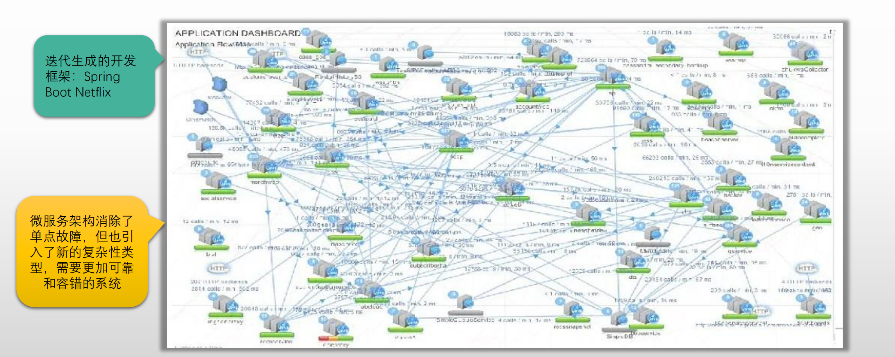

分布式系统的可用性问题:

- 随时可能发生的级联故障
- 整体可用性的不可控

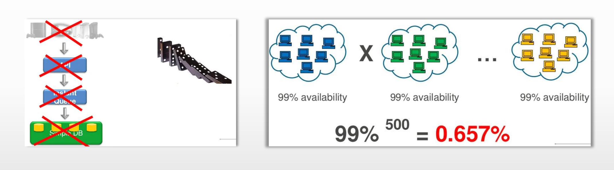

我们假定系统中的每个微服务可用性都是99%,那么串联500个微服务,这个请求的可用性只有0.657%

## 2.5 服务网格作为基础设施解决的问题

### 2.5.1 提升可用性的策略(反脆弱)

提升可用性的策略(反脆弱):弹性处理局部故障,可以认为是一种高级流量治理机制

- 快速失败(Fail Fast)和故障转移(Failover)
	- 超时并重新请求,由调度器将请求发往另一副本(冗余)
- 优雅降级
	- 所有副本都故障时,"熔断"上游服务,当前应用以"降级"形式继续提供服务
- 金丝雀发布
	- 变更是导致脆弱更重要的原因,任何服务上线新版本时都应该基于灰度模式进行

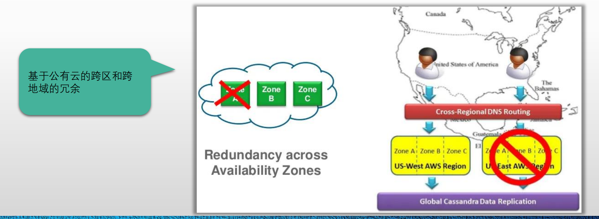

### 2.5.2 数据持久性

- 将非必须的RDBMS转换为分布式的NoSQL系统
- 并借助于S3的快照进行数据备份

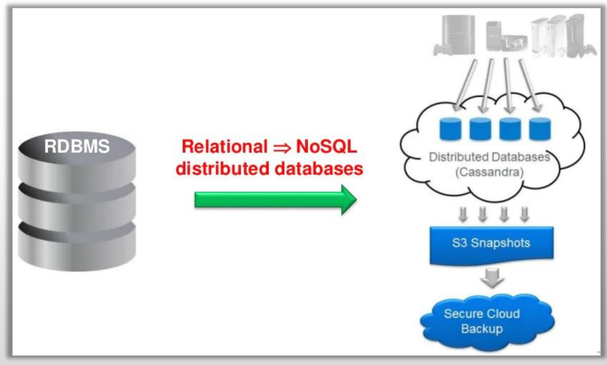

### 2.5.3 检测系统可用性:混沌工程

最初的实现:随机终止在生产环境中运行的ECS实例,以快速了解正在构建的服务是否健壮,有足够的弹性,可以容忍计划外的故障等

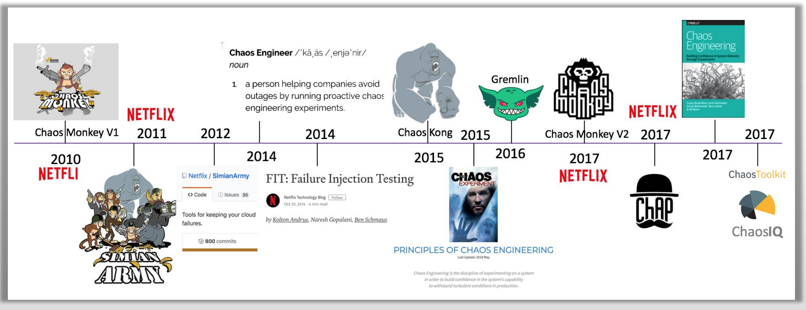

### 2.5.4 应用性能监控和分布式链接跟踪

以请求为中心,记录每个请求经过的服务,和每个服务所消耗的时长

## 2.6 团队和组织文化的改变

### 2.6.1 运维模型

由集中式变为分布式

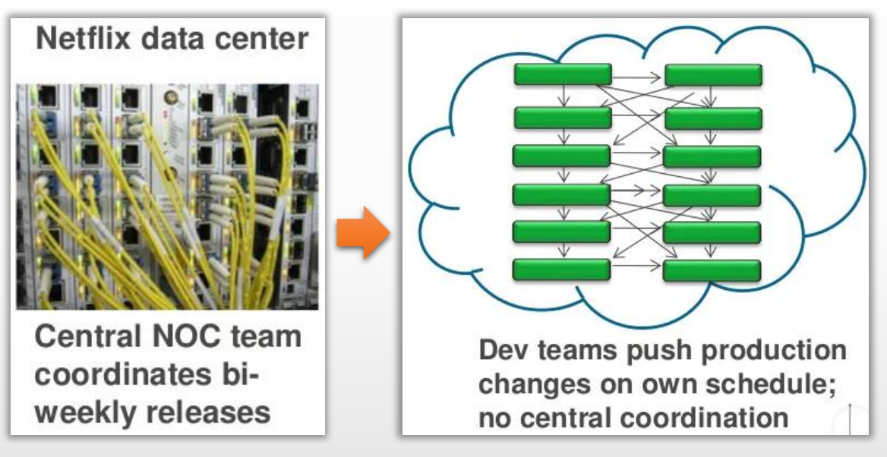

### 2.6.2 发布模型

- 基于AMI(Amazon Machine Image)的红黑部署
- "不可变基础设施":每次变更都要通过发布进行,不允许通过SSH等连接到主机上进行变更操作

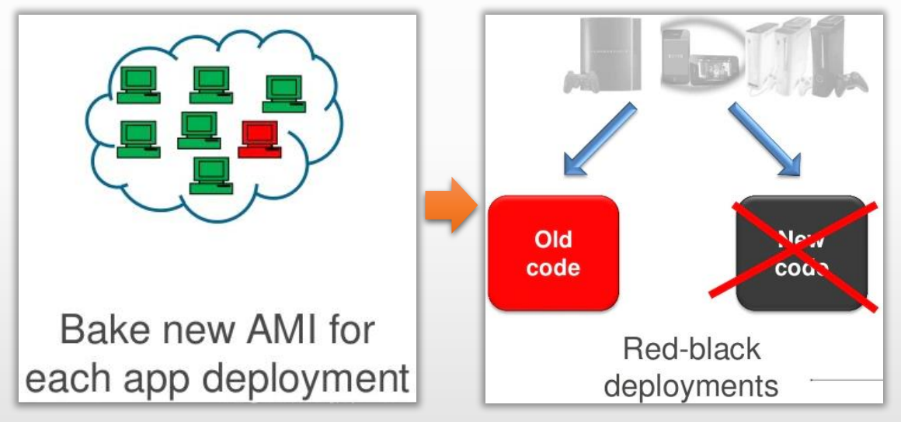

### 2.6.3 团队演进

1. 由IT运维团队管理预算与容量转换为每一个小团队自行决定资源的用量与可视化
2. 由基于中心化的管控逻辑实现运维发布转换为SRE工程师负责构建工具与分享最佳实践机制
3. 由DBA管理数据库转为运维团队管理多个数据库集群
4. 由数据科学研发人员写SQL的方式转换为Hadoop工程师使用Python构建ETL

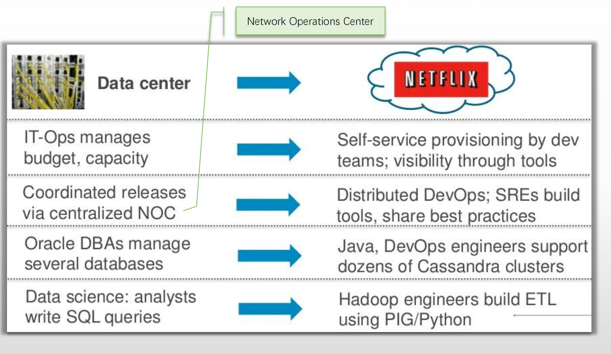

## 2.7 最终实现的系统架构图

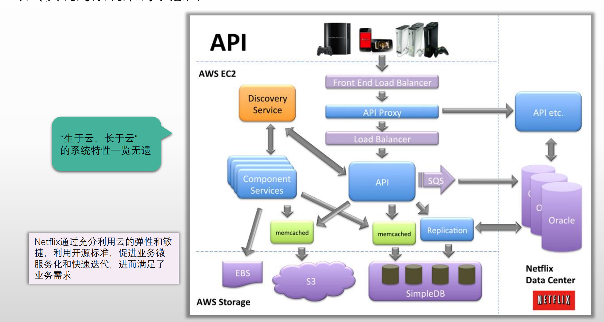

## 2.7 容器技术和Spring Cloud框架的诞生

Netflix以上故事发生的时间点:2013年之前

2013年,这一年

- 因不想不被公有云厂商绑定,OpenStack项目的发展正如火如荼
- VMWare、EMC和通用资本合资成立Pivotal公司
	-  VMWare将所有的Spring项目都转入了Pivotal公司,同年12月,Pivotal发布Spring框架4.0
		-  2009年,VMware收购运行着Java社区最热火的框架Spring的公司SpringSource,以及PaaS供应商Cloud Foundry
	- 2014年,Pivotal发布Spring Boot 1.0
		- 用来简化新Spring应用的初始搭建以及开发过程,从而让基于Spring的开发、测试、配置、部署和监控都变得更加简便
	- 2014年10月,Pivotal发布了第一个Spring Cloud版本
		- 基于Spring Boot,简化了分布式系统基础设施的开发,如服务注册和发现、配置中心、消息总线、负载均衡、断路器、数据监控等,都可以用Spring Boot的开发风格做到一键启动和部署
	- Spring Cloud只是抽象模型,是规范和标准,Netflix实现的Spring Cloud Netflix是其早期最重的实现之一
- Docker开源项目诞生
	- 创造性的使用Image技术,将"系统容器"带入了"应用容器"时代
	- 几乎是从根本上,解决了IaaS时期"跨云难(虚拟机和镜像迁移、共享等)"的问题
	- 为应用发布和持续发布提供了重要支撑

## 2.8 Spring Cloud的核心目标

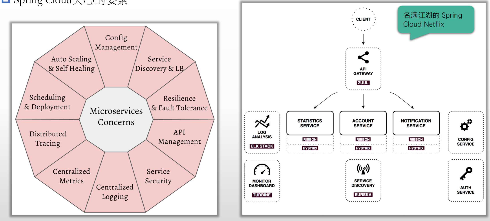

### 2.8.1 主流的Spring Cloud的实现

Spring Cloud Netflix ≠ Spring Cloud

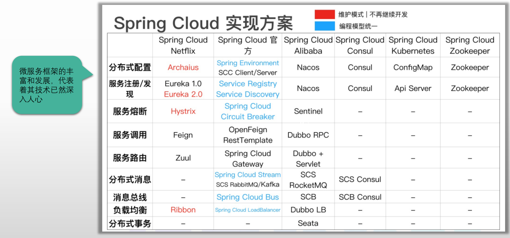

### 2.8.2 12要素

2015年提出的12要素应用到底表达了什么？

- 运行标准
	- Codebase
	- Disposability
	- Dev/Prod Parity
- 编排标准
	- Dependencies
	- Processes
	- Port Binding
- 弹性伸缩标准
	- Processes
	- Concurrency
- CI/CD机制
	- Build、Release and Run
- 监控机制
	- Logs
	- Telemetry

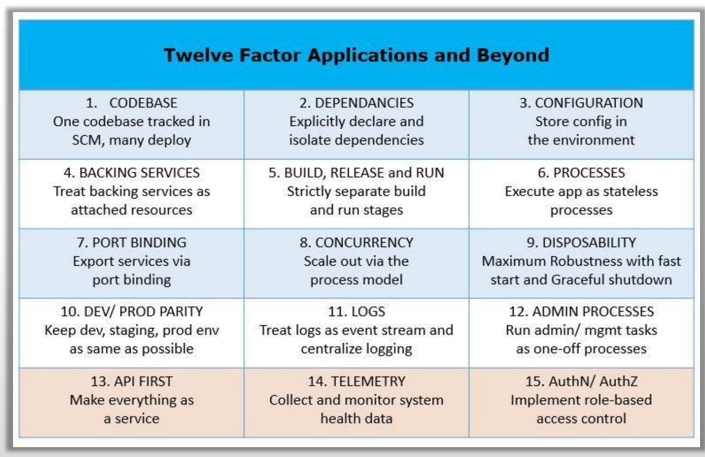

## 2.9 第一阶段的"云原生"小结

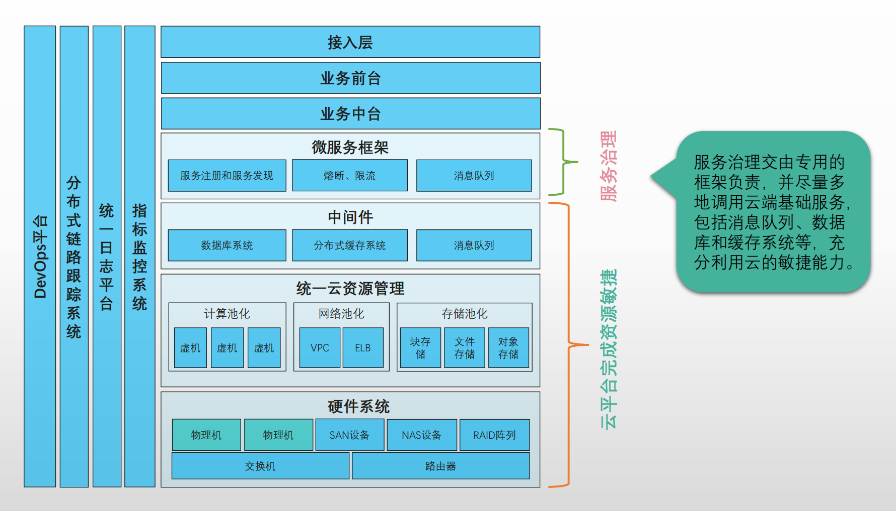