# PART3. 云原生的演进

## 3.1 Kubernetes是什么?

### 3.1.1 Kubernetes

- Kubernetes(也称k8s或"kube")是一款开源的容器编排平台,用于调度以及自动部署、管理和扩展容器化应用
- 该名字源于希腊语,意为"舵手"或"飞行员"
- 最初由Google工程师开发,后来于2014年开源
- 受Google内部集群管理系统Borg的启发

### 3.1.2 Kubernetes集群

- 有效的Kubernetes部署称为集群,也就是一组运行Linux容器的主机
- 可以将Kubernetes集群可视化为两个部分:控制平面与计算设备（或称为工作节点）
	- 每个节点都是其自己的Linux环境,并且可以是物理机或虚拟机
	- 每个节点都运行由若干容器组成的容器集
- 控制平面负责维护集群的预期状态,例如运行哪个应用以及使用哪个容器镜像,工作节点则负责应用和工作负载的实际运行
- 控制平面接受来自管理员(或DevOps团队)的命令,并将这些指令转发给工作节点

### 3.1.3 Kubernetes编排的容器运行时

Docker可被视作由Kubernetes编排的容器运行时

## 3.2 Kubernetes快速成为容器编排的标准

它为何这般茁壮?

- Spring Cloud仅限于Java,而Kubernetes适用于所有编程语言,且解决更广泛的MSA(Microservices Architecture)的问题
- Kubernetes还支持配置环境、设置资源约束、RBAC、管理应用程序生命周期、启用自动扩展和自我修复等,自带反脆弱能力

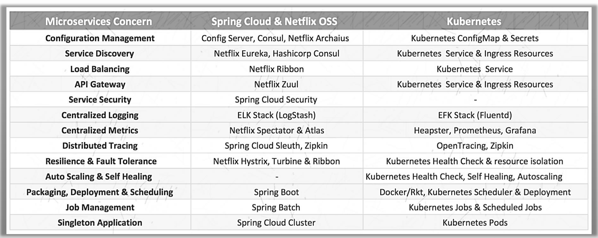

## 3.3 Kubernetes和Spring Cloud

Kubernetes的问题:

- 没有针对不同的平台(例如 Spring Cloud for JVM)进行优化
- 不以开发人员为中心的平台,对DevOps目标的用户具有更友好的特性

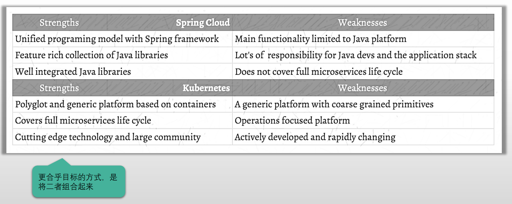

## 3.4 第二阶段的"云原生"小结

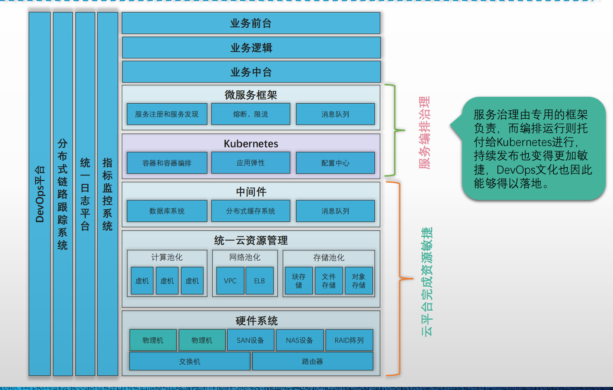

## 3.5 引发的新问题

为了克服服务通信和治理的复杂性,例如服务发现、融合、节流和端到端跟踪的挑战,需要用到专门的微服务治理框架

- 微服务框架,如HSF、Dubbo或Spring Cloud,将这些能力打包成代码库,形成SDK
- 程序员开发微服务时,将这些代码库内置于应用程序中,并随应用程序一起发布和维护

存在问题:库模型可能会抽象出满足微服务架构所需要的特性,但它本身仍然是一个需要维护的组件

- 学习和使用库需要相当程度力量的投入
- 本质上,服务通信和治理是横向连接不同部门的系统,因此与业务逻辑是正交的;但是,在微服务架构中,实现和生命周期是与业务逻辑耦合的,微服务框架的升级会导致整个服务应用的重新构建和重新部署
- 代码库通常与特定语言绑定,因此难以支持企业应用程序的多语言实现

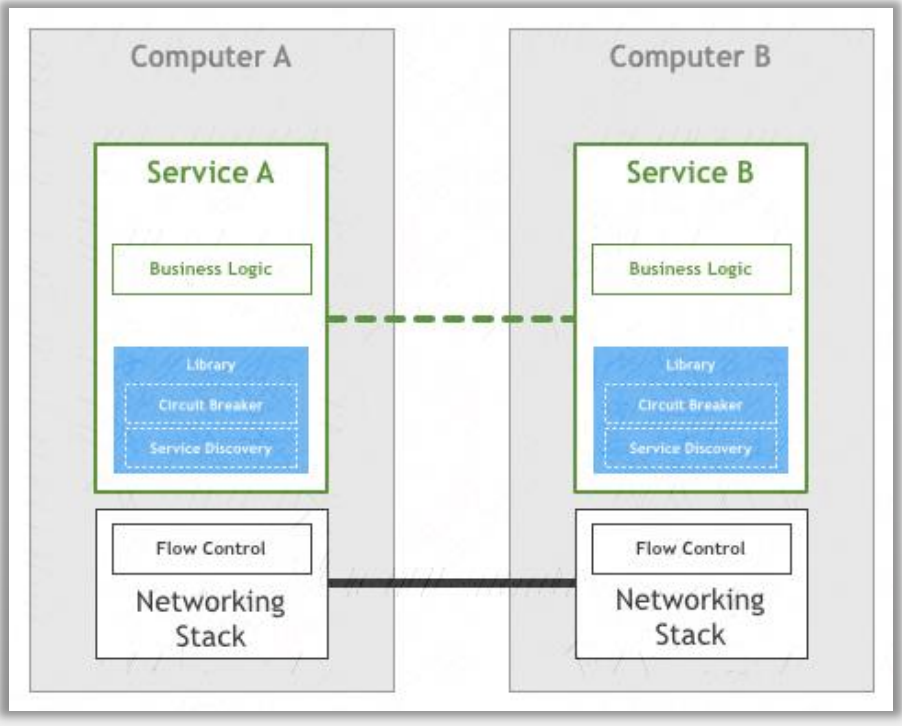

## 3.6 sidecar

下一个合乎逻辑的步骤:

- 将库中的功能整合进Network Stack是不可能的,许多从业者找到的解决方案是使用一个小巧的透明代理来实现
- 使用Sidecar以辅助进程的方式,在应用程序旁边提供高级网络功能

Sidecar:

- 让服务集中解决业务逻辑的问题,网络相关的功能则与业务逻辑剥离,并封装为独立的运行单元并作为服务的反向透明代理,从而不再与业务紧密关联
- 换句话说,微服务的业务程序独立运行,而网络功能则以独立的代理层工作于客户端与服务之间,专门为代理的服务提供熔断、限流、追踪、指标采集和服务发现等功能

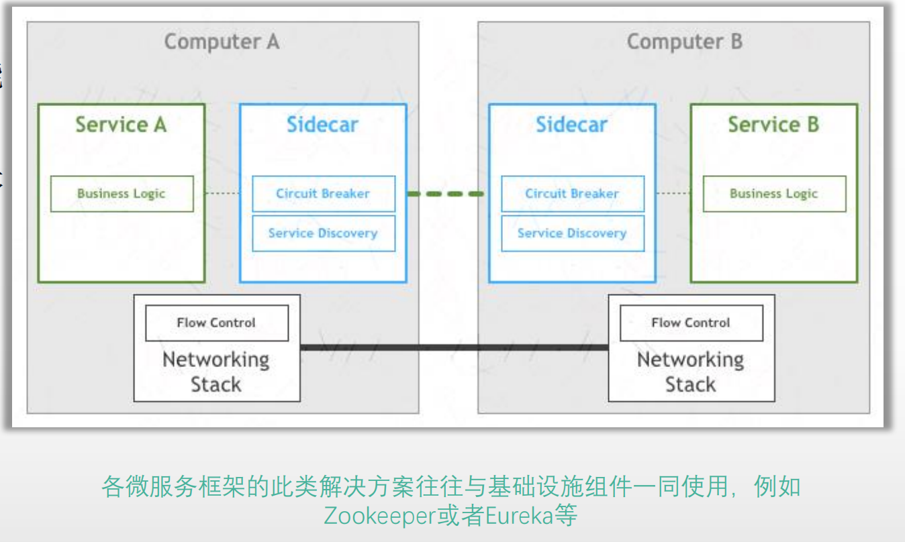

## 3.7 Service Mesh的雏形

将服务治理能力下沉到基础设施中,并将它们部署为服务消费者和服务提供者的独立流程

- 每个服务都使用一个专用的代理Sidecar来完成高级网络功能
- 各服务间仅通过Sidecar代理互相通信
- 各代理之间形成了一个网状网络,2017年,William为其创建一个专用定义,并称之为Service Mesh

A service mesh is a dedicated infrastructure layer for handling service-to-service communication. It’s responsible for the reliable delivery of requests through the complex topology of services that comprise a modern, cloud native application. In practice, the service mesh is typically implemented as an array of lightweight network proxies that are deployed alongside application code, without the application needing to be aware.

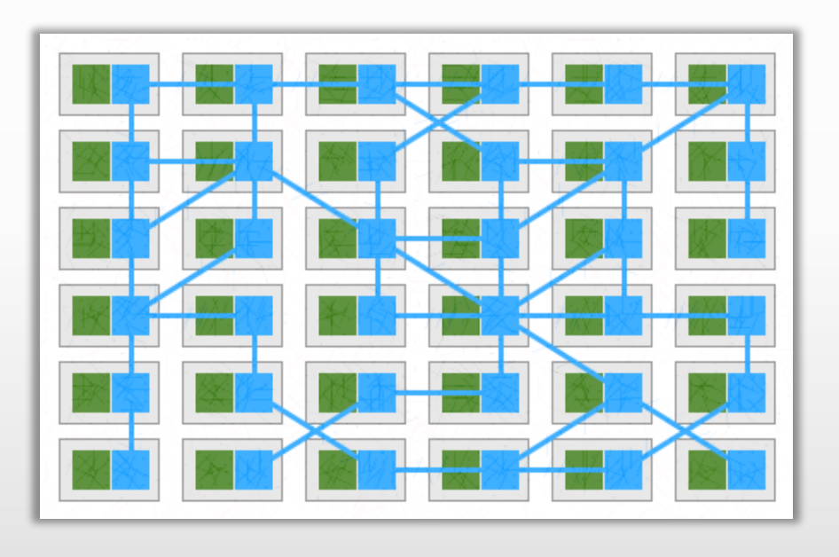

## 3.8 新一代Service Mesh

为Service Mesh中各独立工作的代理提供集中式的"控制平面"

- 实际的服务流量仍然直接在各代理之间完成,但控制平面知道每个代理实例
- 控制平面使代理能够实现诸如访问控制和指标收集之类的事情

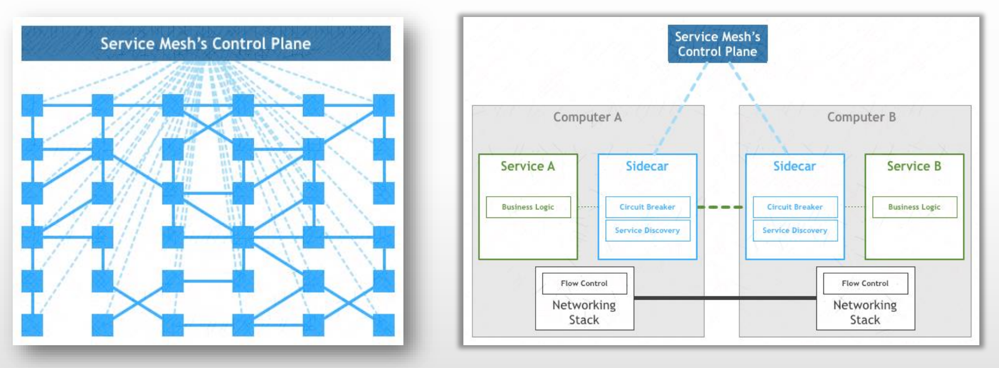

## 3.9 服务治理方式的演进小结

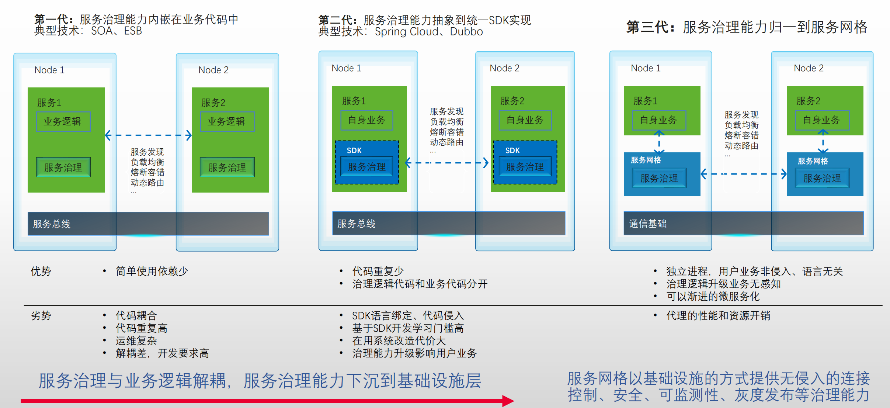

## 3.10 第三阶段的云原生小结

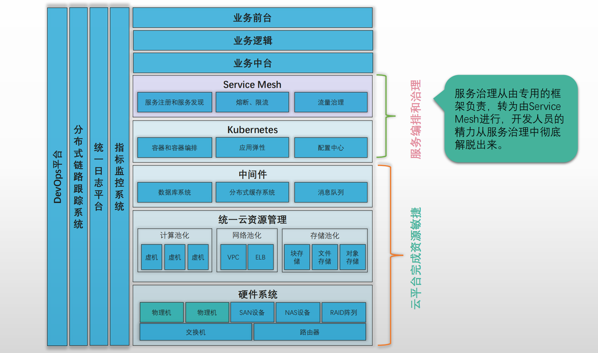

## 3.11 云原生相关概念间的关系

云原生:

- 只有结合云原生所提供的云服务改造应用架构,才能更好地使用云原生技术,更好地构建弹性、稳定、松耦合的分布式应用,并解决分布式复杂性问题
- 对架构的改造还意味着相关的开发模式、交付方式、运维方式等都要随之改变
	- 采用微服务架构重写应用
	- 基于声明式API和自动化工具升级运维方式

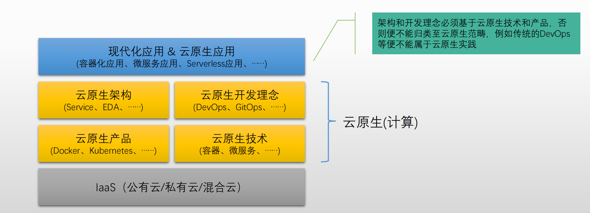

## 3.12 云原生是云计算的再升级

- 重塑开发流水线
- 重新定义软件交付模式
	- 利用容器做整体交付
	- 将Git作为发布、变更的惟一可信源
	- 声明式API
	- 使用OpenAPI作为系统间的集成方式
- 运维模式升级
	- 针对配置变更，云原生倡导基于“不可变基础设施”来版本化一切变更需求
	- 更加彻底的自动化
- 应用架构升级
	- re-platform → re-architect, re-build
- 组织结构升级

## 3.13 企业IT系统云原生三阶段

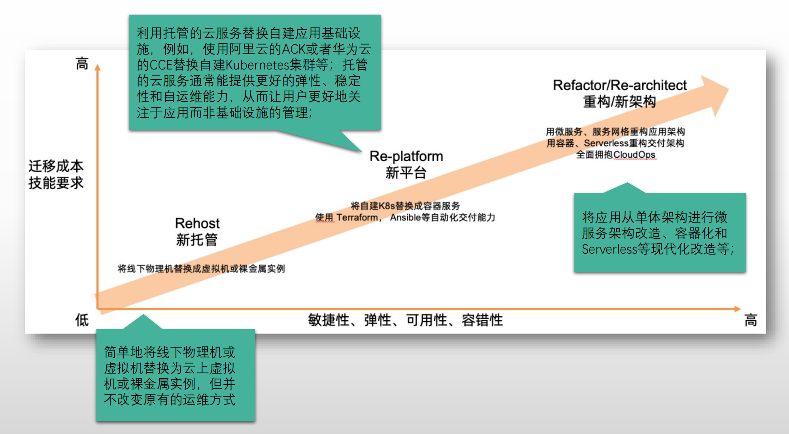

## 3.14 云原生时代典型的互联网技术架构

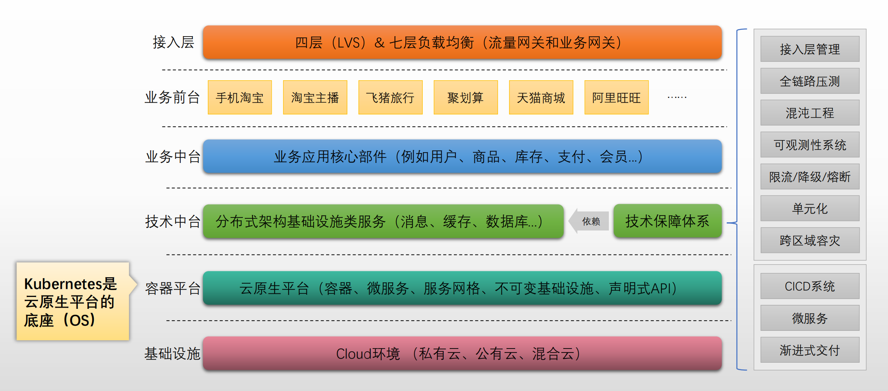