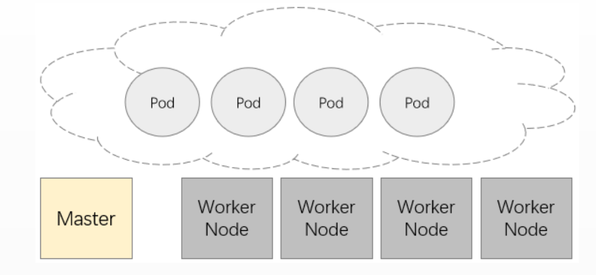
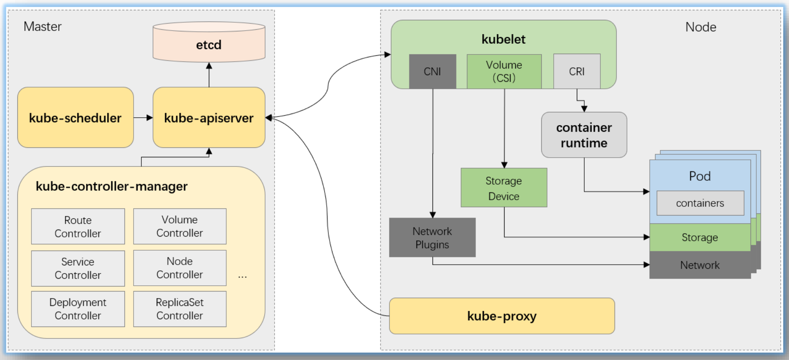

# PART4. Kubernetes集群架构组件及工作机制

## 4.1 Kubernetes集群的节点类型

由Master和Worker两类节点组成

- Master:控制节点
- Worker:工作节点

运行逻辑

- Kubernetes将所有工作节点的资源集结在一起形成一台更加强大的"服务器",称为Kuernetes集群
- 计算和存储接口通过Master之上的API Server暴露
- 客户端通过API提交应用程序的运行请求,而后由Master通过调度算法将其自动指派至某特定的工作节点,以Pod对象的形式运行
- Master会自动处理因工作节点的添加、故障或移除等变动对Pod的影响

## 4.2 Kubernetes集群架构

Kubernetes属于典型的Server-Client形式的二层架构

- Master主要由API Server、Controller-Manager和Scheduler三个组件,以及一个用于集群状态存储的Etcd存储服务组成,它们构成整个集群的控制平面
	- kube-API Server:k8s对外提供的数据范式,是一种声明式API.用于接收用户请求并完成集群协同工作,可以认为是整个集群的总线,但是API Server是无状态的、HTTP/HTTPS协议的Restful API,仅提供数据CRUD的接口
	- etcd:存储k8s的元数据(Pod的定义)
	- kube-scheduler:在用户提交创建资源的请求后,决策该资源最终运行该资源的节点,并将该资源绑定(所谓绑定是指将选定的节点信息填充到资源声明的yaml文件中,这个工作由kube-scheduler来完成)到选定的节点上.被选定节点上的kubelet可以观察到有新的资源被绑定到自身所在的节点上.
	- kube-controller-manager:用于把用户通过API Server提交的请求,遵循某种特定API规范实例化出来,并管理这些实例.当有节点(物理意义上的节点)宕机时,controller会重新请求API Server,在其他节点上再次创建资源,以便满足期望
- 而每个Node节点则主要包含Kubelet、Kube Proxy及容器运行时(docker是最为常用的实现)三个组件,它们承载运行各类应用容器
	- kubelet:从API Server处取出资源定义,然后通过CRI接口调用本机的容器运行时,创建容器.容器创建完毕后,kubelet会持续监视容器,定期将容器的健康状态上报给API Server.当被kubelet监视的pod出现故障时,kubelet会尝试重启该pod以便解决故障(有点像kube-API Server的Client)
	- kube-proxy:为各个pod提供负载均衡.每个节点上的kube-proxy可以将当前节点的内核转换为一个可编程的负载均衡器(也是kube-API Server的Client)

### 4.2.1 Master节点组件

#### 4.2.1.1 API Server

- 整个集群的API网关,相关应用程序为kube-apiserver
- 基于http/https协议以REST风格提供,几乎所有功能全部抽象为"资源"及相关的"对象"
- 声明式API,用于只需要声明对象的"终态",具体的业务逻辑由各资源相关的Controller负责完成
- 无状态,数据存储于etcd中

#### 4.2.1.2 Cluster Store

- 集群状态数据存储系统,通常指的就是etcd
- 仅与API Server交互

#### 4.2.1.3 Controller Manager

- 负责实现客户端通过API提交的终态声明,相应应用程序为kube-controller-manager
- 由相关代码通过一系列步骤驱动API对象的"实际状态"接近或等同"期望状态"
	- 工作于loop模式

#### 4.2.1.4 Scheduler

- 调度器,负责为Pod挑选出(评估这一刻)最合适的运行节点
- 相关程序为kube-scheduler

### 4.2.2 Worker节点组件

#### 4.2.2.1 Kubelet

- Kubernetes集群于每个Worker节点上的**代理**,相应程序为kubelet
- 接收并执行Master发来的指令,管理由Scheduler绑定至当前节点上的Pod对象的容器
	- 通过API Server接收Pod资源定义,或从节点本地目录中加载静态Pod配置
	- 借助于兼容CRI的容器运行时管理和监控Pod相关的容器
		- CRI:容器运行时
		- CNI:网络插件,flannel（CoreOS）、Calico、Cilium...
			- 创建一个虚拟网络,将网络接入外部物理网络
			- 给Pod提供一个虚拟网卡,分配一个IP地址
			- 将该网卡接入一个虚拟网络
		- CSI:卷插件,对接第三方存储服务

#### 4.2.2.2 Kube Proxy

- 运行于每个Worker节点上,专用于负责将Service资源的定义转为节点本地的实现
	- iptables模式:将Service资源的定义转为适配当前节点视角的iptables规则
	- ipvs模式:将Service资源的定义转为适配当前节点视角的ipvs和少量iptables规则
- 是打通Pod网络在Service网络的关键所在

来自集群外部的流量访问,称为南北向流量;来自集群内部的流量访问,称为东西向流量

### 4.2.3 Add-ons

Add-ons(附件)负责扩展Kubernetes集群的功能的应用程序,通常以Pod形式托管运行于Kubernetes集群之上

#### 4.2.3.1 必选附件

- Network Plugin:网络插件,经由CNI接口,负责为Pod提供专用的通信网络,有多种实现
	- CoreOS Flannel
	- ProjectCalico
- Cluster DNS:集群DNS服务器,负责服务注册、发现和名称解析,当下的实现是CoreDNS

#### 4.2.3.2 重要附件

- Ingress Controller:Ingress控制器,负责为Ingress资源提供具体的实现,实现http/https协议的七层路由和流量调度,有多种实现,例如Ingress-Nginx、Contour等
- Metrics Server:Node和Pod等相关组件的核心指标数据收集器,它接受实时查询,但不存储指标数据
- Kubernetes Dashboard/Kuboard/Rainbond:基于Web的UI
- Prometheus:指标监控系统
- ELK/PLG:日集中式日志系统
- OpenELB:适用于非云端部署的Kubernetes环境的负载均衡器,可利用BGP和ECMP协议达到性能最优和高可用性