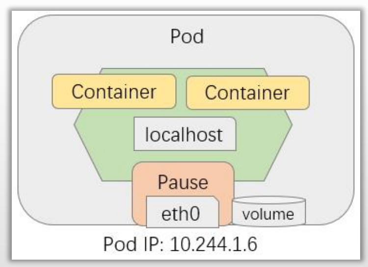
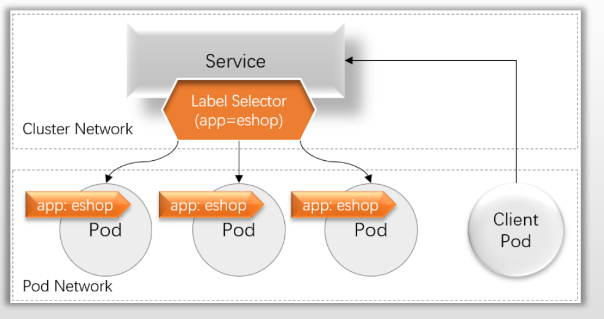
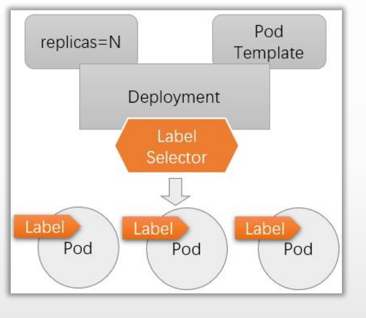
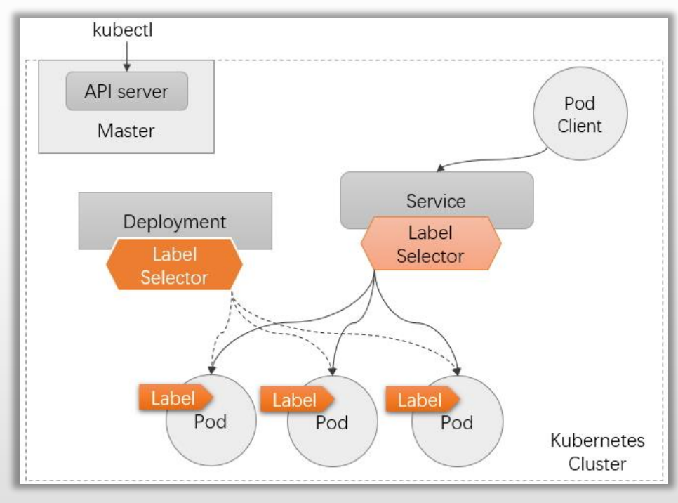
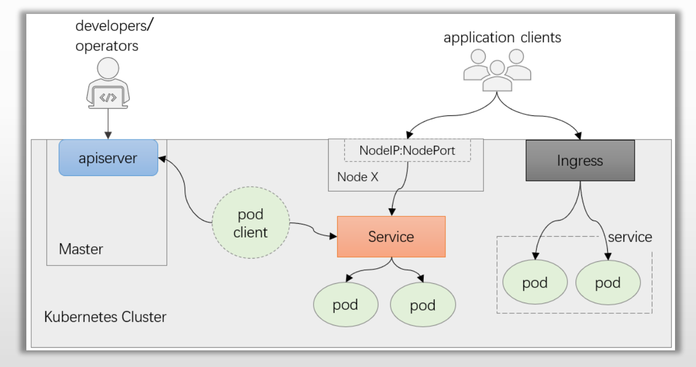

# PART5. Kubernetes应用编排的基本工作逻辑

## 5.1 Pod和应用

Kubernetes本质上是"以应用为中心"的现代应用基础设施,Pod是其运行应用及应用调度的最小逻辑单元

- 本质上是共享Network、IPC和UTS名称空间以及存储资源的**容器集**
	- 可将其想象成一台物理机或虚拟机,各容器就是该主机上的进程
	- 各容器共享网络协议栈、网络设备、路由、IP地址和端口等,但Mount、PID和USER仍隔离
	- 每个Pod上还可附加一个"存储卷(Volume)"作为该"主机"的外部存储,独立于Pod的生命周期,可由Pod内的各容器共享

- 模拟"不可变基础设施",删除后可通过资源清单重建
	- 具有动态性,可容忍误删除或主机故障等异常
	- 存储卷可以确保数据能超越Pod的生命周期

在设计上,仅应该将具有"超亲密"关系的应用分别以不同容器的形式运行于同一Pod内部

## 5.2 为什么要设计Service资源?

Pod具有动态性,其IP地址也会在基于配置清单重构后重新进行分配,因而需要服务发现机制的支撑

Kubernetes使用Service资源和DNS服务(CoreDNS)进行服务发现

- Service能够为一组提供了相同服务的Pod提供负载均衡机制,其IP地址(Service IP,也称为Cluster IP)即为客户端流量入口
- 一个Service对象存在于集群中的各节点之上,不会因个别节点故障而丢失,可为Pod提供固定的前端入口
- Service使用标签选择器(Label Selector)筛选并匹配Pod对象上的标签(Label),从而发现Pod
	- 仅具有符合其标签选择器筛选条件的标签的Pod才可由Service对象作为后端端点使用

## 5.3 Pod和工作负载型控制器

Pod是运行应用的原子单元,其生命周期管理和健康状态监测由kubelet负责完成,而诸如更新、扩缩容和重建等应用编排功能需要由专用的控制器实现,这类控制器即工作负载型控制器

- ReplicaSet和Deployment
- DaemonSet
- StatefulSet
- Job和CronJob

工作负载型控制器也通过标签选择器筛选Pod标签从而完成关联

工作负载型控制器的工作重心

- 确保选定的Pod精确符合期望的数量
	- 数量不足时依据Pod模板创建,超出时销毁多余的对象
- 按配置定义进行扩容和缩容
- 依照策略和配置进行应用更新

## 5.4 部署并访问应用

### 5.4.1 部署应用

- 依照编排需求,选定合适类型的工作负载型控制器
- 创建工作负载型控制器对象,由其确保运行合适数量的Pod对象
- 创建Service对象,为该组Pod对象提供固定的访问入口

### 5.4.2 请求访问Service对象上的服务

- 集群内部的通信流量也称为东西向流量,客户端也是集群上的Pod对象
- Service同集群外部的客户端之间的通信流量称为南北向流量,客户端是集群外部的进程
	- 另外,集群上的Pod也可能会与集群外部的服务进程通信

