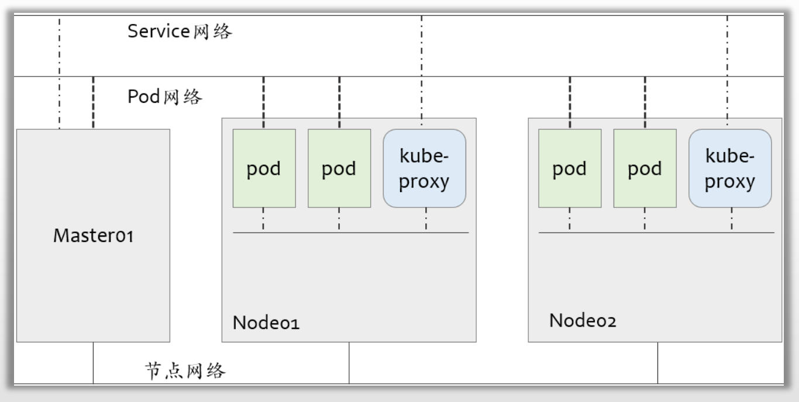

# PART6. Kubernetes网络基础

## 6.1 Kubernetes网络模型

Kubernetes集群上会存在三个分别用于节点、Pod和Service的网络

- 于worker上完成交汇
- 由节点内核中的路由模块,以及iptables/netfilter和ipvs等完成网络间的流量转发

1. 物理节点(宿主机节点)之间要互通
2. Service网络:用于代理后端pod端点的网络
3. Pod网络

### 6.1.1 节点网络

- 集群节点间的通信网络,并负责打通与集群外部端点间的通信
- 网络及各节点地址需要于Kubernetes部署前完成配置,非由Kubernetes管理,因而,需要由管理员手动进行,或借助于主机虚拟化管理程序进行

### 6.1.2 Pod网络

- 为集群上的Pod对象提供的网络
- 虚拟网络,需要经由CNI网络插件实现,例如Flannel、Calico、Cilium等

### 6.1.3 Service网络

- 在部署Kubernetes集群时指定,各Service对象使用的地址将从该网络中分配
- Service对象的IP地址存在于其相关的iptables或ipvs规则中
- 由Kubernetes集群自行管理

## 6.3 Kubernetes集群中的通信流量

Kubernetes网络中主要存在4种类型的通信流量

- 同一Pod内的容器间通信
- Pod间的通信
- Pod与Service间的通信
- 集群外部流量与Service间的通信

Pod网络需要借助于第三方兼容CNI规范的网络插件完成，这些插件需要满足以下功能要求

- 所有Pod间均可不经NAT机制而直接通信
- 所有节点均可不经NAT机制直接与所有Pod通信
- 所有Pod对象都位于同一平面网络中