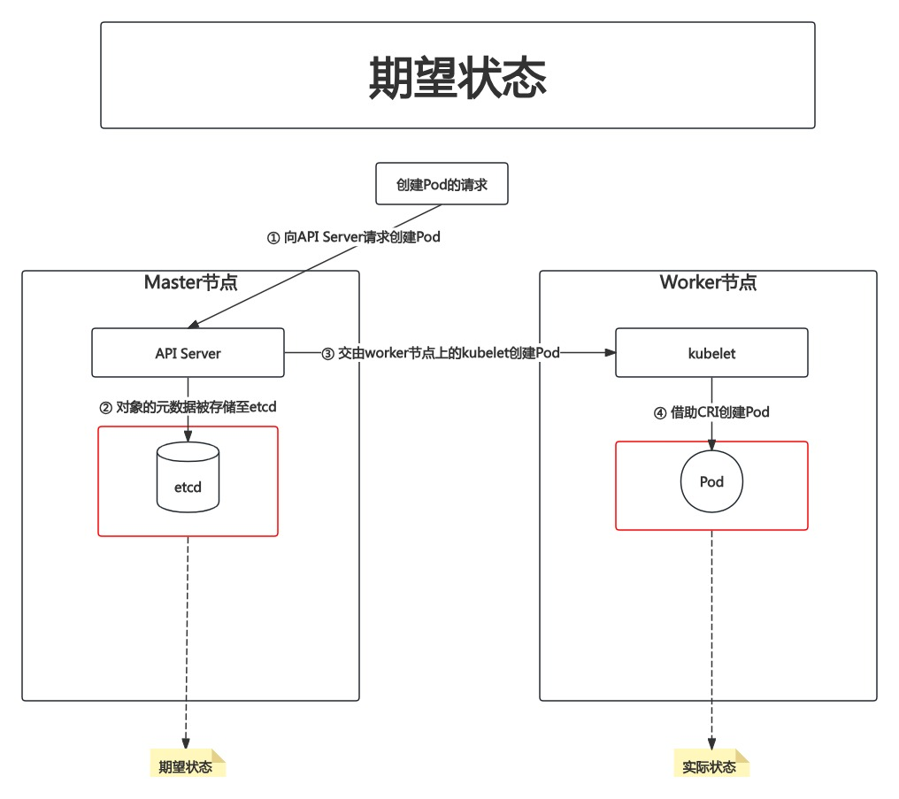

# PART7. 期望状态

## 7.1 控制器模式

Controller会持续检测实际状态是否与期望状态相符,若不相符,则尝试让实际状态与期望状态相同.若实际状态无法与期望状态相同,则尝试让实际状态无限逼近期望状态.而这个确保实际状态无限接近或完全等同于期望状态的检测过程是一个死循环,我们称之为调谐循环(Concilation Loop)

## 7.2 Platform for Platfrom

- Kubernetes + Istio = 服务网格平台
- Kubernetes + Istio + Knative = Serverless BaaS平台
- Kubernetes + Kafka Operator + Kafka = Kafka平台