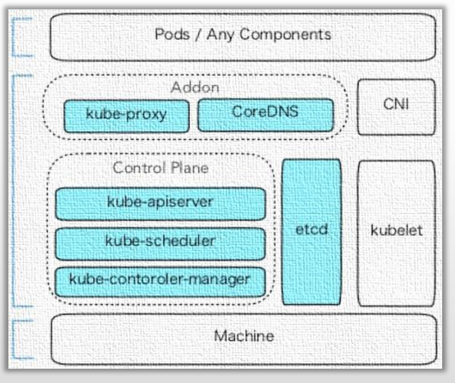
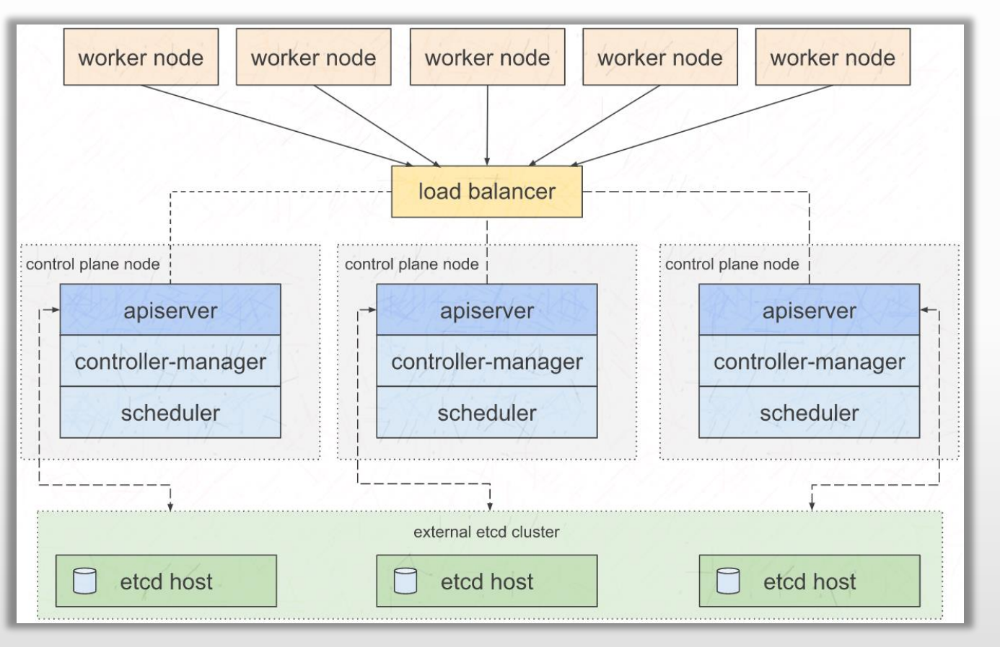
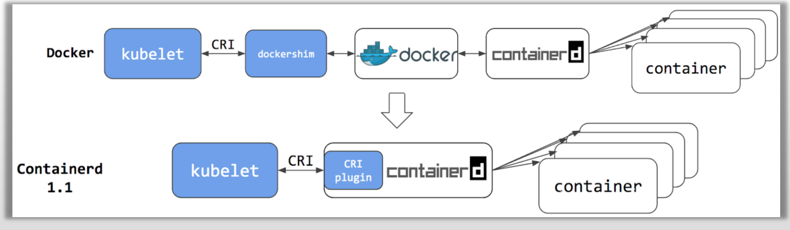

# PART8. 部署Kubernetes集群

## 8.1 Kubernetes集群组件运行模式

### 8.1.1 独立组件模式

- 除Add-ons以外,各关键组件以二进制方式部署于节点上,并运行于守护进程
- 各Add-ons以Pod形式运行

### 8.1.2 静态Pod模式

- 控制平面各组件以静态Pod对象运行于Master主机之上
	- 静态Pod:kubelet自动扫描/监视当前节点上的某个特定目录,在该目录下定义的pod,kubelet不需要依赖API Server也可以将其创建并运行起来.
- kubelet和docker以二进制部署,运行为守护进程
- kube-proxy等则以Pod形式运行
- k8s.gcr.io

## 8.2 部署前提

使用kubeadm部署Kubernetes集群的前提条件

- 支持Kubernetes运行的Linux主机,例如Debian、RedHat及其变体等
- 每主机2GB以上的内存,以及2颗以上的CPU
- 各主机间能够通过网络正常通信,支持各节点位于不同的网络中
- 独占的hostname、MAC地址以及product_uuid(`cat /sys/class/dmi/id/product_uuid`查看即可),主机名能够正常解析
- 放行由Kubernetes使用到的各端口,或直接禁用iptables
- 禁用各主机的上的Swap设备
	- ubuntu22.04默认不开启swap
- 各主机时间同步
	- ubuntu22.04默认使用`systemd-timesyncd`作为时间同步服务

准备代理服务,以便接入`registry.k8s.io`,或根据部署过程提示的方法获取相应的Image

重要提示

- kubeadm不仅支持集群部署,还支持集群**升级、卸载、更新数字证书**等功能
- 目前,kubeadm为各节点默认生成的SSL证书的有效期限为**1年**,在到期之前需要renew这些证书

## 8.3 需要开放的端口

## 8.4 安装工具

## 8.5 kubeadm

kubeadm:**Kubernetes社区**提供的集群构建工具

- 负责执行构建一个最小化可用集群并将其启动等必要的基本步骤
- Kubernetes集群全生命周期管理工具,可用于实现集群的部署、升级/降级及卸载等
- kubeadm仅关心如何初始化并拉起一个集群,其职责仅限于下图中背景着色的部分

注意:图中的`kube-proxy`和`CoreDNS`是动态托管的Pod,而非静态Pod

## 8.6 kubeadm支持的控制平面高可用模型

### 8.6.1 stacked etcd

堆叠式etcd:控制平面每个节点上都会部署一个etcd,这也就意味着要求控制平面的节点数量为奇数个.这种情况下控制平面中每个节点上的API Server都只访问本地的etcd,我们也不需要对etcd做LB,任何一个节点的宕机,都不会影响其他节点上的API Server访问其本地的etcd

在控制平面的各个节点前有一层LB,负责对来自worker节点上kubelet的请求做负载均衡,路由到各个控制平面节点上

### 8.6.2 external etcd

非堆叠式etcd:etcd有自己独立的集群.控制平面也有其独立的集群.这种方式的高可用,对控制平面的节点个数就没有要求了

## 8.7 Kubernetes集群示例环境

[附录1-K8S集群搭建](https://github.com/rayallen20/K8SRepeat/blob/master/day1/%E9%99%84%E5%BD%951-K8S%E9%9B%86%E7%BE%A4%E6%90%AD%E5%BB%BA.md)

## 8.8 Kubernetes弃用Docker了吗?

Kubernetes接入Docker和Containerd的两种方式:

- 调用链一:kubelet通过CRI调用`dockershim`,而后`dockershim`调用`docker`,再由`docker`通过`containerd`管理容器
	- 用户基础好
	- Kubernetes自1.24版开始,正式从kubelet中移除`dockershim`相关的代码,`dockershim`被弃用
	- 但是Mirantis又提供了`cri-docker`项目,以kubelet外部独立运行的CRI服务替代`dockershim`

- 调用链二:kubelet通过CRI调用`Containerd`,而后`Containerd`直接管理容器
	- 性能损耗低
	- 不再支持docker客户端管理容器

使用Containerd的方式,可以节省掉dockershim和Docker这两个环节,提升性能