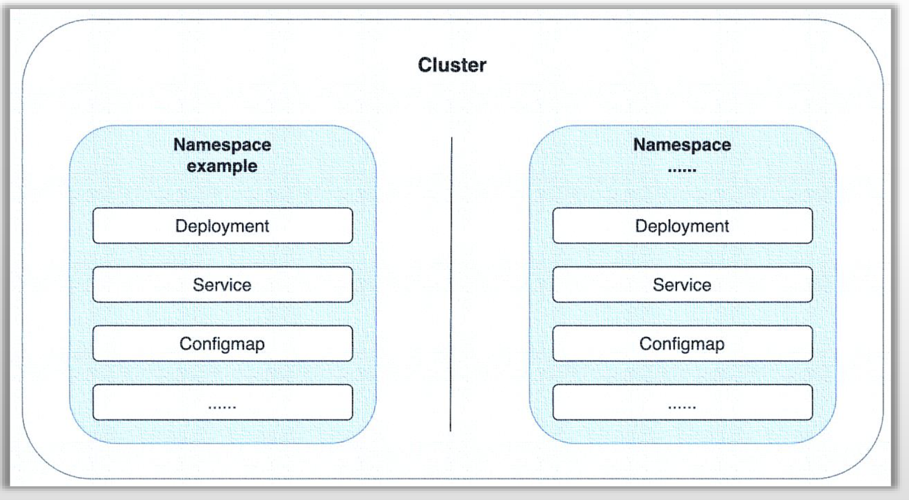

# PART2. Namespace

## 2.1 Namespace基础

Namespace:

- 是Kubernetes集群提供对内部资源进行"软隔离"的机制,以方便用户管理和组织集群资源
- 可以将其想像成虚拟的"子集群"



## 2.2 管理命名空间

K8S中的命名空间可以划分为2种类型:

- 系统级命名空间:由Kubernetes集群默认创建,主要用来隔离系统级的资源对象
- 自定义命名空间:由用户按需创建

### 2.2.1 系统级命名空间

```
root@longinus-master-1:~/k8s-yaml# kubectl get namespace
NAME              STATUS   AGE
default           Active   2d14h
kube-flannel      Active   2d13h
kube-node-lease   Active   2d14h
kube-public       Active   2d14h
kube-system       Active   2d14h
```

- `default`:默认的命名空间,为任何命名空间级别的资源提供的默认设定
- `kube-system`:Kubernetes集群自身组件及其它系统级组件使用的命名空间,Kubernetes自身的关键组件均部署在该命名空间中
- `kube-public`:公众开放的命名空间,所有用户(包括Anonymous)都可以读取内部的资源
- `kube-node-lease`:节点租约资源所用的命名空间
	- 分布式系统通常使用"租约(Lease)"机制来锁定共享资源并协调集群成员之间的活动
		- 这里我们假定控制平面有3个节点,也就是说集群中存在3个`kube-scheduler`.那么很明显,它们的工作模式为APP模式,即同一时刻只有1个是活跃的,剩下2个是备用的,因为这3个的决策结果可能是不同的.如果它们同时决策,那么集群就崩了.如果活跃的`kube-scheduler`宕机了,那么剩下2个`kube-scheduler`就会抢占存在于`kube-node-lease`命名空间下的锁,谁抢占到了,谁就再次成为活跃的`kube-scheduler`.类似的这种锁信息,都存在于`kube-node-lease`命名空间中
	- Kubernetes上的租约概念由API群组`coordination.k8s.io`群组下的Lease资源所承载,以支撑系统级别的功能需求.例如节点心跳(node heartbeats)和组件级的领导选举等
	- Kubernetes集群的每个节点,在该命名空间下都有一个与节点名称同名的Lease资源对象

```
root@longinus-master-1:~/k8s-yaml# kubectl get lease -n kube-node-lease
NAME                HOLDER              AGE
longinus-master-1   longinus-master-1   2d14h
longinus-node-1     longinus-node-1     2d13h
longinus-node-2     longinus-node-2     2d13h
longinus-node-3     longinus-node-3     2d13h
```

- 所有的系统级命名空间均**不能**进行删除操作,而且除default外,其它三个也**不应该**用作业务应用的部署目标

## 2.3 需要使用命名空间的情形

### 2.3.1 环境管理

需要在同一Kubernetes集群上隔离研发、预发和生产等一类的环境时,可以通过命名空间进行

### 2.3.2 隔离

多个团队的不同产品线需要部署于同一Kubernetes集群时,可以使用命名空间进行隔离

### 2.3.3 资源控制

- 命名空间可用作资源配额的承载单位,从而限制其内部所有应用可以使用的CPU/Memory/PV各自的资源总和
- 需要在产品线或团队等隔离目标上分配各自总体可用的系统资源时,可通过命名空间实现

### 2.3.4 权限控制

- 基于RBAC鉴权体系,能够在命名空间级别进行权限配置

### 2.3.5 提高集群性能

- 进行资源搜索时,命名空间有利于Kubernetes API缩小查找范围,从而对减少搜索延迟和提升性能有一定的帮助

## 2.4 创建命名空间

### 2.4.1 查看命名空间对象的配置清单格式

```
root@longinus-master-1:~/k8s-yaml# kubectl create namespace demo --dry-run=client -o yaml
```

```yaml
# v1: 核心资源群组
apiVersion: v1
kind: Namespace
# 注意: Namespace资源是集群级别的,所以不要在metadata字段下再声明namesapce
metadata:
  creationTimestamp: null
  name: demo
spec: {}
status: {}
```

注意,虽然这里的`spec`字段和`status`字段为空对象,但实际上可以从这两个字段推测出来,Namespace也是由NamespaceController管控的

```
root@longinus-master-1:~/k8s-yaml# kubectl api-resources
NAME                              SHORTNAMES   APIVERSION                             NAMESPACED   KIND
...
namespaces                        ns           v1                                     false        Namespace
...
```

### 2.4.2 以声明式对象配置的方式创建Namespace

#### 2.4.2.1 创建资源清单

```
root@longinus-master-1:~/k8s-yaml# vim namespace-demo.yaml 
root@longinus-master-1:~/k8s-yaml# cat namespace-demo.yaml
```

```yaml
# v1: 核心资源群组
apiVersion: v1
kind: Namespace
# # 注意: Namespace资源是集群级别的,所以不要在metadata字段下再声明namesapce
metadata:
  name: demo
```

#### 2.4.2.2 创建Namespace

```
root@longinus-master-1:~/k8s-yaml# kubectl apply -f namespace-demo.yaml 
namespace/demo created
```

#### 2.4.2.3 查看创建结果

```
root@longinus-master-1:~/k8s-yaml# kubectl get namespace demo
NAME   STATUS   AGE
demo   Active   47s
```

### 2.4.3 删除Namespace

删除:

```
root@longinus-master-1:~/k8s-yaml# kubectl delete namespace demo
namespace "demo" deleted
```

查看删除结果:

```
root@longinus-master-1:~/k8s-yaml# kubectl get namespace demo
Error from server (NotFound): namespaces "demo" not found
```

注意:删除Namespace时,该Namespace下的所有资源对象都会被级联删除.这个级联删除的功能可以关闭,但是你需要在删除Namespace前,为该Namespace下的所有资源对象找一个新的Namespace,否则删除后这些资源对象会变成孤立状态.因此删除操作一定要慎重.