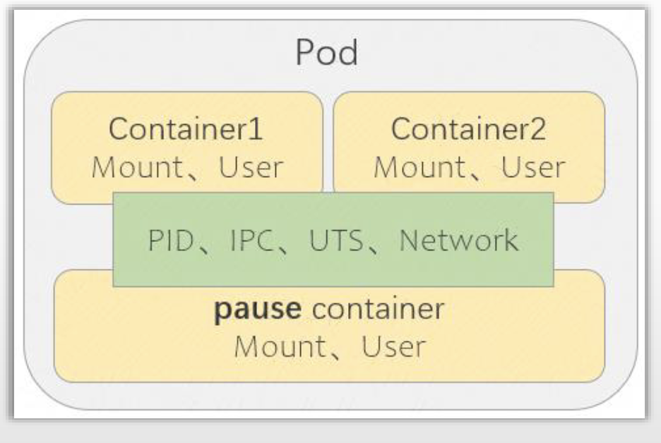
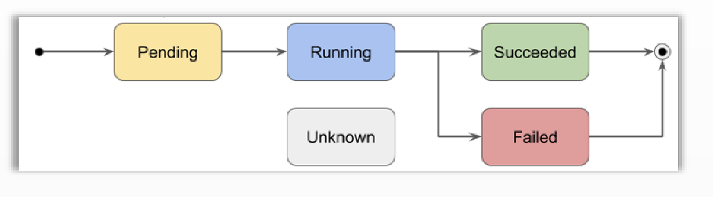

# PART3. Pod功能、资源规范及使用入门

## 3.1 关于Pod

什么是Pod?

- 一个或多个容器的集合,因而也可称为容器集,但却是Kubernetes调度、部署和运行应用的原子单元
- 另外封装的内容:可被该组容器共享的存储资源、网络协议栈及容器的运行控制策略等
- 依赖于pause容器事先创建出可被各应用容器共享的基础环境,它默认共享Network、IPC和UTS命名空间给各容器,PID命名空间也可以共享,但需要用户显式定义



如图所示,同一个Pod内的多个容器本身(不需额外的人为设定)就是共享Network Namespace、UTS Namespace以及IPC Namespace以及PID Namespace的.

甚至关联到该Pod上的卷(也就是外部存储空间),也不是关联到每一个应用容器上的,而是关联到底层的pause容器,这个容器是每个Pod的底层基础设施,pause容器为运行在Pod中的各个应用容器提供**可共享的**基础环境.

pause容器在Pod启动之后,它本身是不运行的,它仅仅是为了支撑每个Pod的基础环境.

Pod可以被类比为是一个轻量级的虚拟机,因为共享Network Namespace、UTS Namespace以及IPC Namespace以及PID Namespace,所以从任何一个应用容器的视角上看,其主机名、网络接口、IP地址、socket甚至都是一致的.因此运行在同一个Pod的多个容器,更像是运行在同一主机上的、共享同一内核空间的多个不同进程.

之所以说可以类比但不完全相同,是因为同一Pod中的多个容器,还是有自己独立的Namespace的,例如Mount Namespace.这就意味着每个容器都有自己独立且隔离的文件系统.因此如果2个容器想要共享数据,一般还要通过挂载外部卷的方式来实现.

Pod这个单词的本意为豆荚,豆荚里包含多个豆子,每个豆子都可以类比为一个容器,而Pod就是容器集.

K8S之所以设计为将Pod作为最小编排/调度单元,而非将容器作为最小编排/调度单元,是因为在实现容器间的特定关系管理,遇到了一种特殊的场景:

想象一下在物理机上的2个进程,它们彼此之间可能需要:

1. 共享数据

	通过某种逻辑完成共享数据,使得二者成为共生关系.这种方式要求各进程要能够通过同一文件系统或同一命名空间来完成数据交换.

2. Client-Server通信模式

	要求进程间能够实现网络连通
	
很明显需要共享数据的2个进程,二者的关系更加紧密.

现代容器技术就是依赖内核的Namespace功能实现的.

我们假定将宿主机的Namespace称为root namespace;将容器的Namespace称为container namespace.container namespace中,主要使用6种Namespace.

举个例子,假设有2个以容器形式运行的进程,彼此之间需要基于内存或文件系统来完成数据共享或数据交换,可以使用同一个卷来实现.也可以使用共享同一个Namespace的方式来完成资源的共享,例如共享Network Namespace,则可以实现2个容器共享相同的网络协议栈/共享同一组网络设备等.这就要求这些容器**必须运行在同一台主机上**才能做到,这也就是为什么K8S设计为将Pod作为最小编排/调度单元的原因.

Pod的组成形式有两种:

- 单容器Pod:仅含有单个容器
- 多容器Pod:含有多个具有"超亲密"关系的容器
	- 同一Pod内的所有容器都将运行于由Scheduler选定的同一个节点上

问题:过去的C-S模式的多个进程(例如LNMP组合),是否应该组织在同一个Pod中?

答案:很显然,这个组合中,Nginx、MySQL、PHP不是具有超亲密关系的,这种关系仅仅是简单的C-S通信.不要说容器化时代,就是物理机时代,也经常是将Nginx部署在节点A上,把MySQL部署在节点B上.因此这三者应该是3个独立的Pod.除非你设计这三者只能通过loopback(就是127.0.0.1)通信,否则它们不具备超亲密关系

问题:什么样的容器是具有超亲密关系的呢?

答案:例如Istio.它实际上就是在应用容器外部附着了一个代理程序,而这个代理程序和应用容器之间,就是通过loopback进行通信的,且该应用容器的客户端只能看到代理程序,这个代理实际上就是一个sidecar容器.

## 3.2 Pod资源规范的基础框架

Pod该由谁负责创建?

- 之前说过,Pod可以由用户通过API Server自行创建,这种Pod叫做自主型Pod
	- 这种方式很少使用,因为有缺陷.因为这种Pod创建完之后,由kube-scheduler调度给某个节点,然后该节点通过API Server读取配置并创建该Pod在当前节点上运行.若该Pod出现故障则当前节点的kubelet会尝试恢复.
	- 但如果这个节点宕机了,这种Pod随着节点上的kubelet失联,都会失联.kube-scheduler不会重新将该Pod调度到其他节点上去.**以这种方式创建的Pod,一旦被kube-scheduler调度并绑定至某一节点后,只要用户没有再重新创建,则这个调度结果永久生效,即使这个节点宕机了**
- 也可以由kubelet通过加载配置文件直接创建,这种Pod叫做静态Pod(Static Pod)
- 还可以由工作负载型控制器创建,例如Deployment.这种Pod称为托管式Pod
	- 为了能从节点级故障恢复过来,应该使用工作负载型控制器来创建Pod.因为工作负载型控制器是通过一种叫做Pod模板的资源对象来创建Pod的.基于同一个Pod模板,可以创建同一个Pod的多个副本,也就是replicas.指定数量后,工作负载型控制器基于Pod模板向API Server请求创建指定数量的Pod.
	- Pod创建完成后,工作负载型控制器会实时监控K8S集群中特定的命名空间下,标签选择器能够选中的Pod数量是否与期望的数量相同.这时如果发生节点级故障,工作负载型控制器通过API Server就能发现出现了不健康的Pod,这时工作负载型控制器会请求API Server重建1个Pod.而这个重建的过程仍然是通过Pod模板实现的.以这种方式创建的Pod,即使发生了节点级故障,仍然能够确保Pod有足够数量的副本处于健康状态

一个极简的Pod定义,仅需要为其指定一个要运行的容器即可:

- 查看pod的定义方式:`kubectl explain pod`

声明一个自主型Pod(注意,这种方式很少使用,此处只是为了演示如何创建Pod而使用):

```
root@longinus-master-1:~/k8s-yaml# vim pod-demo.yaml
root@longinus-master-1:~/k8s-yaml# cat pod-demo.yaml
```

```yaml
# 核心群组API
apiVersion: v1
kind: Pod
metadata:
  # pod的标识名 在同一命名空间中必须唯一
  name: pod-demo
  # pod所属的命名空间
  namespace: demo
# 期望状态
spec:
  # 定义pod中的容器 该字段是一个list<[]Container]>类型的字段 可定义多个容器
  containers:
      # 容器名称 必选字段 在当前Pod中唯一
    - name: demo
      # 创建容器时使用的镜像
      image: ikubernetes/demoapp:v1.0
```

创建Pod:

```
root@longinus-master-1:~/k8s-yaml# kubectl apply -f pod-demo.yaml 
pod/pod-demo created
```

查看创建结果:

```
root@longinus-master-1:~/k8s-yaml# kubectl get -f pod-demo.yaml -o wide
NAME       READY   STATUS    RESTARTS   AGE     IP           NODE              NOMINATED NODE   READINESS GATES
pod-demo   1/1     Running   0          2m49s   10.244.1.7   longinus-node-1   <none>           <none>
```

这里多提一嘴关于Pod被分配的的IP地址.这个IP地址通常与节点有关联关系.我们在搭建集群时,设定Pod的CIDR为`10.244.0.0/16`.为了避免在各节点上给Pod分配IP地址时发生冲突,K8S将这个网络地址划分为了多个子网,给每个节点分配一个小子网,这个小子网专门用于该节点上Pod的运行.

Flannel使用24位的子网掩码,也就是说从`10.244.0.0/24`开始,到`10.244.255.0/24`为止,每个IP表示一个小子网,最多只能容纳256个节点.每个节点上最多容纳256个Pod


****

注:24位的子网掩码通常表示为`255.255.255.0`.在IP地址中,子网掩码用于区分网络地址和主机地址的部分.IP地址由32位组成,分为4个8位的字节(或称为八位组),每个8位字节用一个十进制数表示,数之间由点分隔.

在24位子网掩码中,前24位(即前3个8位字节)被设定为1,这表示这部分用于网络地址.剩下的8位(最后一个8位字节)被设定为0,这表示这部分用于主机地址.所以,`255.255.255.0`的子网掩码意味着前3个8位字节用于识别网络,而最后一个8位字节用于识别特定网络内的主机.

查看每个节点被划分的子网:

```
root@longinus-master-1:~/k8s-yaml# kubectl get node longinus-master-1 -o yaml|grep podCIDR:
  podCIDR: 10.244.0.0/24
root@longinus-master-1:~/k8s-yaml# kubectl get node longinus-node-1 -o yaml|grep podCIDR:
  podCIDR: 10.244.1.0/24
root@longinus-master-1:~/k8s-yaml# kubectl get node longinus-node-2 -o yaml|grep podCIDR:
  podCIDR: 10.244.2.0/24
root@longinus-master-1:~/k8s-yaml# kubectl get node longinus-node-3 -o yaml|grep podCIDR:
  podCIDR: 10.244.3.0/24
```

****

修改配置清单,改为1个pod中运行多个容器:

```
root@longinus-master-1:~/k8s-yaml# vim pod-demo.yaml 
root@longinus-master-1:~/k8s-yaml# cat pod-demo.yaml
```

```yaml
# 核心群组API
apiVersion: v1
kind: Pod
metadata:
  # pod的标识名 在同一命名空间中必须唯一
  name: pod-demo
  # pod所属的命名空间
  namespace: demo
# 期望状态
spec:
  # 定义pod中的容器 该字段是一个list<[]Container]>类型的字段 可定义多个容器
  containers:
      # 容器名称 必选字段 在当前Pod中唯一
    - name: demo
      # 创建容器时使用的镜像
      image: ikubernetes/demoapp:v1.0
    - name: proxy
      image: nginx:1.22
```

再次使用`kubectl apply`部署Pod时,会遇到一些错误:

```
root@longinus-master-1:~/k8s-yaml# kubectl apply -f pod-demo.yaml 
The Pod "pod-demo" is invalid: spec.containers: Forbidden: pod updates may not add or remove containers
```

这是因为资源对象上的有些字段,一旦创建后不允许修改.而`kubectl apply`是不存在则创建,存在则修改.而有些字段允许运行时修改,有些字段不允许.很明显这里的`spec.containers`字段就是不允许运行时修改的.

因此只能是先删除Pod,再创建Pod

```
root@longinus-master-1:~/k8s-yaml# kubectl delete -f pod-demo.yaml 
pod "pod-demo" deleted
root@longinus-master-1:~/k8s-yaml# kubectl get pod -n demo -o wide
NAME       READY   STATUS             RESTARTS      AGE     IP           NODE              NOMINATED NODE   READINESS GATES
pod-demo   1/2     CrashLoopBackOff   5 (38s ago)   3m28s   10.244.1.8   longinus-node-1   <none>           <none>
```

很明显这里我们变更之后,Pod没有成功运行.因此需要检查原因:

```
root@longinus-master-1:~/k8s-yaml# kubectl describe pod pod-demo -n demo
Name:             pod-demo
Namespace:        demo
Priority:         0
Service Account:  default
Node:             longinus-node-1/192.168.1.57
Start Time:       Fri, 19 Jan 2024 18:39:12 +0800
Labels:           <none>
Annotations:      <none>
Status:           Running
IP:               10.244.1.8
IPs:
  IP:  10.244.1.8
Containers:
  demo:
    Container ID:   containerd://bf17d4974e2a16e6a9b03741987718dc72f0cc2f27c42b34276ddfc597649a4a
    Image:          ikubernetes/demoapp:v1.0
    Image ID:       docker.io/ikubernetes/demoapp@sha256:6698b205eb18fb0171398927f3a35fe27676c6bf5757ef57a35a4b055badf2c3
    Port:           <none>
    Host Port:      <none>
    State:          Waiting
      Reason:       CrashLoopBackOff
    Last State:     Terminated
      Reason:       Error
      Exit Code:    1
      Started:      Fri, 19 Jan 2024 18:42:02 +0800
      Finished:     Fri, 19 Jan 2024 18:42:02 +0800
    Ready:          False
    Restart Count:  5
    Environment:    <none>
    Mounts:
      /var/run/secrets/kubernetes.io/serviceaccount from kube-api-access-psrdt (ro)
  proxy:
    Container ID:   containerd://ec42a7f925ff92991407832e2b0025ebe3fdd9128789c34804420d9b03ce7364
    Image:          nginx:1.22
    Image ID:       docker.io/library/nginx@sha256:fc5f5fb7574755c306aaf88456ebfbe0b006420a184d52b923d2f0197108f6b7
    Port:           <none>
    Host Port:      <none>
    State:          Running
      Started:      Fri, 19 Jan 2024 18:39:12 +0800
    Ready:          True
    Restart Count:  0
    Environment:    <none>
    Mounts:
      /var/run/secrets/kubernetes.io/serviceaccount from kube-api-access-psrdt (ro)
Conditions:
  Type              Status
  Initialized       True 
  Ready             False 
  ContainersReady   False 
  PodScheduled      True 
Volumes:
  kube-api-access-psrdt:
    Type:                    Projected (a volume that contains injected data from multiple sources)
    TokenExpirationSeconds:  3607
    ConfigMapName:           kube-root-ca.crt
    ConfigMapOptional:       <nil>
    DownwardAPI:             true
QoS Class:                   BestEffort
Node-Selectors:              <none>
Tolerations:                 node.kubernetes.io/not-ready:NoExecute op=Exists for 300s
                             node.kubernetes.io/unreachable:NoExecute op=Exists for 300s
Events:
  Type     Reason     Age                   From               Message
  ----     ------     ----                  ----               -------
  Normal   Scheduled  4m4s                  default-scheduler  Successfully assigned demo/pod-demo to longinus-node-1
  Normal   Pulled     4m4s                  kubelet            Container image "nginx:1.22" already present on machine
  Normal   Created    4m4s                  kubelet            Created container proxy
  Normal   Started    4m4s                  kubelet            Started container proxy
  Warning  BackOff    2m39s (x7 over 4m1s)  kubelet            Back-off restarting failed container demo in pod pod-demo_demo(f280fd2c-eb70-4d8a-bdb3-b06e8b34d03d)
  Normal   Pulled     2m27s (x5 over 4m4s)  kubelet            Container image "ikubernetes/demoapp:v1.0" already present on machine
  Normal   Created    2m26s (x5 over 4m4s)  kubelet            Created container demo
  Normal   Started    2m26s (x5 over 4m4s)  kubelet            Started container demo
```

排查思路:

- step1. 先看这个Pod被调度到了哪个节点上

```
root@longinus-master-1:~/k8s-yaml# kubectl get pod -n demo -o wide
NAME       READY   STATUS             RESTARTS        AGE   IP           NODE              NOMINATED NODE   READINESS GATES
pod-demo   1/2     CrashLoopBackOff   7 (3m14s ago)   10m   10.244.1.8   longinus-node-1   <none>           <none>
```

- step2. 去这个节点上看demoapp容器的日志

```
root@longinus-node-1:~# crictl ps -a
CONTAINER           IMAGE               CREATED              STATE               NAME                 ATTEMPT             POD ID              POD
f241d2a432949       3342b7518915f       About a minute ago   Exited              demo                 6                   8f1ad53d98866       pod-demo
ec42a7f925ff9       0f8498f13f3ad       5 minutes ago        Running             proxy                0                   8f1ad53d98866       pod-demo
9667b4796c911       0f8498f13f3ad       18 hours ago         Running             nginx                0                   ea7a600b495d8       nginx-6bbc57b98d-nknpg
396a29abf9148       0dc86fe0f22e6       3 days ago           Running             kube-flannel         0                   f9aa4efde589c       kube-flannel-ds-vstfj
55e89a2f4e22a       0dc86fe0f22e6       3 days ago           Exited              install-cni          0                   f9aa4efde589c       kube-flannel-ds-vstfj
07e13a89a2b97       a55d1bad692b7       3 days ago           Exited              install-cni-plugin   0                   f9aa4efde589c       kube-flannel-ds-vstfj
823c3dd44d35b       01cf8d1d322dd       3 days ago           Running             kube-proxy           0                   c5038236096e2       kube-proxy-tblv7
```

```
root@longinus-node-1:~# crictl logs f241d2a432949
Traceback (most recent call last):
  File "/usr/local/bin/demo.py", line 91, in <module>
    main(sys.argv[1:])
  File "/usr/local/bin/demo.py", line 87, in main
    app.run(host=str(host), port=int(port), debug=bool(debug))
  File "/usr/lib/python3.8/site-packages/flask/app.py", line 841, in run
    run_simple(host, port, self, **options)
  File "/usr/lib/python3.8/site-packages/werkzeug/serving.py", line 1052, in run_simple
    inner()
  File "/usr/lib/python3.8/site-packages/werkzeug/serving.py", line 996, in inner
    srv = make_server(
  File "/usr/lib/python3.8/site-packages/werkzeug/serving.py", line 862, in make_server
    return BaseWSGIServer(
  File "/usr/lib/python3.8/site-packages/werkzeug/serving.py", line 740, in __init__
    HTTPServer.__init__(self, server_address, handler)
  File "/usr/lib/python3.8/socketserver.py", line 452, in __init__
    self.server_bind()
  File "/usr/lib/python3.8/http/server.py", line 138, in server_bind
    socketserver.TCPServer.server_bind(self)
  File "/usr/lib/python3.8/socketserver.py", line 466, in server_bind
    self.socket.bind(self.server_address)
OSError: [Errno 98] Address in use
```

看到`OSError: [Errno 98] Address in use`,就很明确了.很明显在同一个Pod内,出现了端口争用的问题.

## 3.3 了解Pod的运行状况

### 3.3.1 打印Pod完整的资源规范

```
kubectl explain pod
```

### 3.3.2 打印Pod当前状态

```
kubectl get pod POD_NAME -o yaml
```

看status字段

### 3.3.3 打印Pod资源的详细状态

```
kubectl describe pod POD_NAME
```

### 3.3.4 获取Pod中容器应用的日志

```
kubectl logs POD_NAME -c CONTAINER_NAME
```

注意,`kubectl logs`命令后边没有指明资源对象类型,这是因为K8S中只有Pod这种资源对象是有日志的

例:

```
root@longinus-master-1:~/k8s-yaml# kubectl logs pod-demo -c demo -n demo
Traceback (most recent call last):
  File "/usr/local/bin/demo.py", line 91, in <module>
    main(sys.argv[1:])
  File "/usr/local/bin/demo.py", line 87, in main
    app.run(host=str(host), port=int(port), debug=bool(debug))
  File "/usr/lib/python3.8/site-packages/flask/app.py", line 841, in run
    run_simple(host, port, self, **options)
  File "/usr/lib/python3.8/site-packages/werkzeug/serving.py", line 1052, in run_simple
    inner()
  File "/usr/lib/python3.8/site-packages/werkzeug/serving.py", line 996, in inner
    srv = make_server(
  File "/usr/lib/python3.8/site-packages/werkzeug/serving.py", line 862, in make_server
    return BaseWSGIServer(
  File "/usr/lib/python3.8/site-packages/werkzeug/serving.py", line 740, in __init__
    HTTPServer.__init__(self, server_address, handler)
  File "/usr/lib/python3.8/socketserver.py", line 452, in __init__
    self.server_bind()
  File "/usr/lib/python3.8/http/server.py", line 138, in server_bind
    socketserver.TCPServer.server_bind(self)
  File "/usr/lib/python3.8/socketserver.py", line 466, in server_bind
    self.socket.bind(self.server_address)
OSError: [Errno 98] Address in use
```

### 3.3.5 进入Pod内的容器

```
kubectl exec POD_NAME -c CONTAINER_NAME -- COMMAND
```

例:

```
root@longinus-master-1:~/k8s-yaml# kubectl exec -it pod-demo -c proxy -n demo -- /bin/sh
# pwd
/
# ls
bin  boot  dev	docker-entrypoint.d  docker-entrypoint.sh  etc	home  lib  lib64  media  mnt  opt  proc  root  run  sbin  srv  sys  tmp  usr  var
# exit
root@longinus-master-1:~/k8s-yaml# 
```

注意:这里是没有办法进入demoapp容器的,因为这个容器根本就没起来

## 3.4 Pod的phase和重启策略

### 3.4.1 Pod的相位



像刚刚的例子中,Pod中的容器启动失败了,但是Pod自身却没有退出.需要注意的是,Pod有Pod的状态,容器有容器的状态,但这些状态都在`kubectl get pod`中的`STATUS`列中显示:

```
root@longinus-master-1:~/k8s-yaml# kubectl get pod -n demo
NAME       READY   STATUS             RESTARTS        AGE
pod-demo   1/2     CrashLoopBackOff   15 (109s ago)   49m
```

这里的`STATUS`描述的未必是Pod的状态,也有可能是Pod中的Container的信息.和Pod的phase不完全一致.

但是,查看Pod的信息时,Pod中的phase字段是描述Pod的状态信息的:

```
root@longinus-master-1:~/k8s-yaml# kubectl get pod pod-demo -n demo -o jsonpath='{.status.phase}'
Running
```

后边有一个小节专门讲这个话题,这里只是简单介绍Pod的Phase:

- Pending:通常是因为刚刚发出创建Pod的请求,Pod的运行条件尚未得到满足(比如:所需的镜像还没有拉取完毕/节点上的资源不足以运行该Pod等),导致无法将该Pod调度到目标节点上
- Running:所有运行条件都得到了满足,Pod已经运行起来了.但是这个phase并不代表Pod中的容器全都正常运行
- Successed:成功结束.通常出现在作业类应用中,表示运行的任务已经达成了,或者用户手动终止了任务的运行
- Failed:异常终止
- Unknown:未知.Pod的状态由kubelet不停地向API Server报告而成的,而kubelet自己都失联了,因此被该kubelet监控的Pod的phase也就成了Unknown

### 3.4.2 容器的状态

- Waiting:等待资源得到满足
- Running:所有资源都得到了满足并处于运行中
- Terminated:容器终止.这个终止是接收到了终止信号终止的,但至于这个终止信号是否正常,那就不好说了
- Unknown:和Pod的Unknown成因相同

### 3.4.3 Pod的重启策略

问题:某个容器出现故障,该如何解决?

答案:也许重启大法确实是能解决问题的.

因此Pod的重启策略用于指定:如果Pod中的容器可以在Waiting/Running/Terminated这几种状态之间转换,那么如果容器出翔故障时,到底要不要重启这个容器.

Pod的重启策略:决定了容器终止后是否应该重启

- Always:无论何种exit code,只要容器退出了,就立即重启容器
- OnFailure:仅在exit code为非0值(即错误退出)时才重启容器
- Never:无论何种exit code,都不重启容器

```
root@longinus-master-1:~/k8s-yaml# kubectl get pod pod-demo -n demo -o jsonpath='{.spec.restartPolicy}'
Always
```

这里我们修改pod-demo的重启策略为仅失败时重启:

```
root@longinus-master-1:~/k8s-yaml# vim pod-demo.yaml 
root@longinus-master-1:~/k8s-yaml# cat pod-demo.yaml
```

```yaml
# 核心群组API
apiVersion: v1
kind: Pod
metadata:
  # pod的标识名 在同一命名空间中必须唯一
  name: pod-demo
  # pod所属的命名空间
  namespace: demo
# 期望状态
spec:
  # 定义pod中的容器 该字段是一个list<[]Container]>类型的字段 可定义多个容器
  containers:
      # 容器名称 必选字段 在当前Pod中唯一
    - name: demo
      # 创建容器时使用的镜像
      image: ikubernetes/demoapp:v1.0
    - name: proxy
      image: nginx:1.22
  # 重启策略: 启动失败时重启
  restartPolicy: OnFailure
```

删除并创建Pod:

```
root@longinus-master-1:~/k8s-yaml# kubectl delete -f pod-demo.yaml 
pod "pod-demo" deleted
root@longinus-master-1:~/k8s-yaml# kubectl apply -f pod-demo.yaml 
pod/pod-demo created
```

查看Pod的重启策略:

```
root@longinus-master-1:~/k8s-yaml# kubectl get pod pod-demo -n demo -o jsonpath='{.spec.restartPolicy}'
OnFailure
```

## 3.5 Pod创建后的其他字段是哪儿来的?

```
root@longinus-master-1:~/k8s-yaml# kubectl get pod pod-demo -n demo -o yaml
```

```yaml
apiVersion: v1
kind: Pod
metadata:
  annotations:
    kubectl.kubernetes.io/last-applied-configuration: |
      {"apiVersion":"v1","kind":"Pod","metadata":{"annotations":{},"name":"pod-demo","namespace":"demo"},"spec":{"containers":[{"image":"ikubernetes/demoapp:v1.0","name":"demo"},{"image":"nginx:1.22","name":"proxy"}]}}
  creationTimestamp: "2024-01-19T10:39:12Z"
  name: pod-demo
  namespace: demo
  resourceVersion: "224247"
  uid: f280fd2c-eb70-4d8a-bdb3-b06e8b34d03d
spec:
  containers:
  - image: ikubernetes/demoapp:v1.0
    imagePullPolicy: IfNotPresent
    name: demo
    resources: {}
    terminationMessagePath: /dev/termination-log
    terminationMessagePolicy: File
    volumeMounts:
    - mountPath: /var/run/secrets/kubernetes.io/serviceaccount
      name: kube-api-access-psrdt
      readOnly: true
  - image: nginx:1.22
    imagePullPolicy: IfNotPresent
    name: proxy
    resources: {}
    terminationMessagePath: /dev/termination-log
    terminationMessagePolicy: File
    volumeMounts:
    - mountPath: /var/run/secrets/kubernetes.io/serviceaccount
      name: kube-api-access-psrdt
      readOnly: true
  dnsPolicy: ClusterFirst
  enableServiceLinks: true
  nodeName: longinus-node-1
  preemptionPolicy: PreemptLowerPriority
  priority: 0
  restartPolicy: Always
  schedulerName: default-scheduler
  securityContext: {}
  serviceAccount: default
  serviceAccountName: default
  terminationGracePeriodSeconds: 30
  tolerations:
  - effect: NoExecute
    key: node.kubernetes.io/not-ready
    operator: Exists
    tolerationSeconds: 300
  - effect: NoExecute
    key: node.kubernetes.io/unreachable
    operator: Exists
    tolerationSeconds: 300
  volumes:
  - name: kube-api-access-psrdt
    projected:
      defaultMode: 420
      sources:
      - serviceAccountToken:
          expirationSeconds: 3607
          path: token
      - configMap:
          items:
          - key: ca.crt
            path: ca.crt
          name: kube-root-ca.crt
      - downwardAPI:
          items:
          - fieldRef:
              apiVersion: v1
              fieldPath: metadata.namespace
            path: namespace
status:
  conditions:
  - lastProbeTime: null
    lastTransitionTime: "2024-01-19T10:39:12Z"
    status: "True"
    type: Initialized
  - lastProbeTime: null
    lastTransitionTime: "2024-01-19T11:47:51Z"
    message: 'containers with unready status: [demo]'
    reason: ContainersNotReady
    status: "False"
    type: Ready
  - lastProbeTime: null
    lastTransitionTime: "2024-01-19T11:47:51Z"
    message: 'containers with unready status: [demo]'
    reason: ContainersNotReady
    status: "False"
    type: ContainersReady
  - lastProbeTime: null
    lastTransitionTime: "2024-01-19T10:39:12Z"
    status: "True"
    type: PodScheduled
  containerStatuses:
  - containerID: containerd://a1c7c4388ab56115c0f90a645dcb5053847817f9631bdddf739b68dfd9c720e4
    image: docker.io/ikubernetes/demoapp:v1.0
    imageID: docker.io/ikubernetes/demoapp@sha256:6698b205eb18fb0171398927f3a35fe27676c6bf5757ef57a35a4b055badf2c3
    lastState:
      terminated:
        containerID: containerd://a1c7c4388ab56115c0f90a645dcb5053847817f9631bdddf739b68dfd9c720e4
        exitCode: 1
        finishedAt: "2024-01-19T12:18:25Z"
        reason: Error
        startedAt: "2024-01-19T12:18:25Z"
    name: demo
    ready: false
    restartCount: 25
    started: false
    state:
      waiting:
        message: back-off 5m0s restarting failed container=demo pod=pod-demo_demo(f280fd2c-eb70-4d8a-bdb3-b06e8b34d03d)
        reason: CrashLoopBackOff
  - containerID: containerd://ec42a7f925ff92991407832e2b0025ebe3fdd9128789c34804420d9b03ce7364
    image: docker.io/library/nginx:1.22
    imageID: docker.io/library/nginx@sha256:fc5f5fb7574755c306aaf88456ebfbe0b006420a184d52b923d2f0197108f6b7
    lastState: {}
    name: proxy
    ready: true
    restartCount: 0
    started: true
    state:
      running:
        startedAt: "2024-01-19T10:39:12Z"
  hostIP: 192.168.1.57
  phase: Running
  podIP: 10.244.1.8
  podIPs:
  - ip: 10.244.1.8
  qosClass: BestEffort
  startTime: "2024-01-19T10:39:12Z"
```

很明显这个创建出来的Pod,比我们写的配置清单,多了很多字段.那么问题来了,这些字段哪儿来的?

K8S有一种非常重要的能力叫做Admission Controller,即准入控制器.K8S通过准入控制器机制,在创建任何类型的资源对象时,将那些可选但我们没有填写的字段,使用准入Admission Controller的mutating控制器来自动填充这些字段.

Admission Controller分为2种:

- mutating
- validating

可以理解为,我们虽然写的字段很少,但API Server内部会使用默认值去填充其他字段的值.