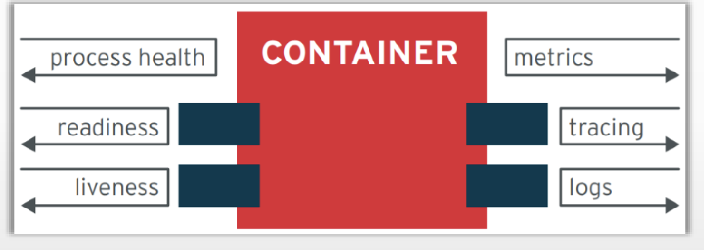
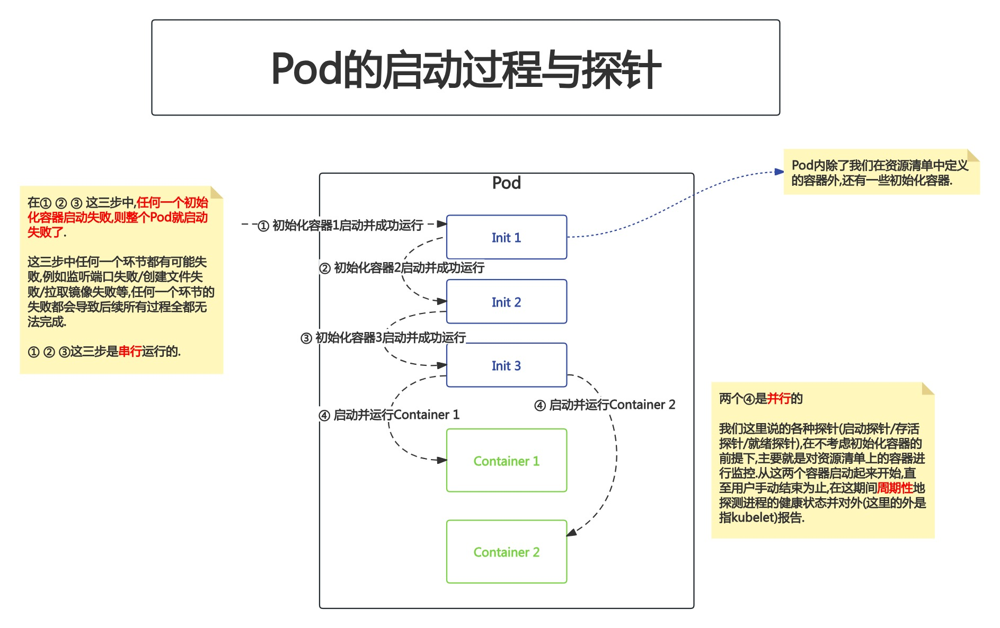
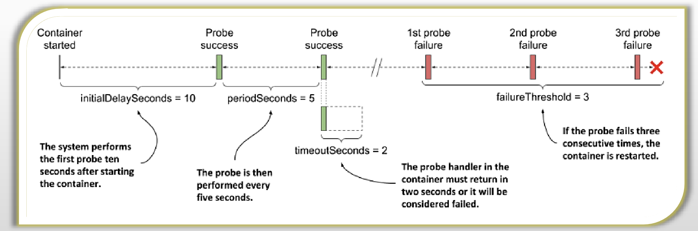
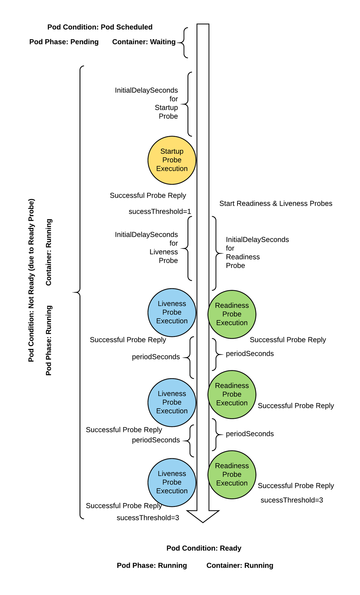
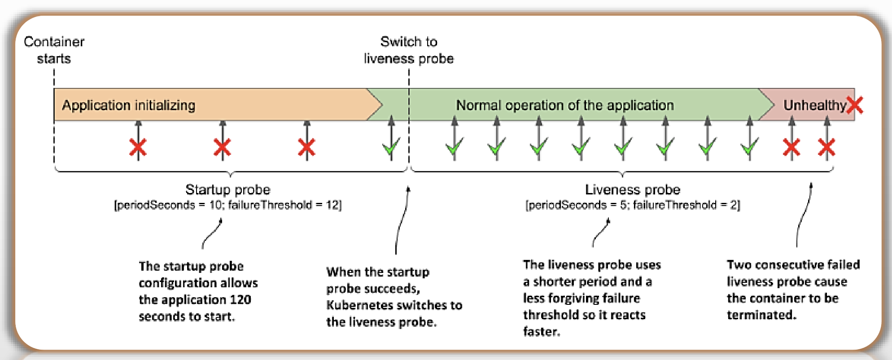

# PART4. Pod容器化配置及探针

## 4.1 通过环境变量向容器传递参数

环境变量是容器化应用的常用配置方式之一.

在容器上嵌套使用env字段:

- 每个环境变量需要通过`name`字段给出既定的名称
- 传递的值则定义在`value`字段上

### 4.1.1 容器应用的配置方式

通常配置应用的常用途径:

- 要么是走配置文件(比如nginx的配置文件)
- 要么是走命令行传参(比如`mysql -uroot -p`)

对于容器化应用,则可以通过:

- 在构建镜像时,使用`CMD`或`ENTRYPOINT`指令,自定义在容器启动时要运行的命令
	- 针对太复杂的配置项,通常需要使用`ENTRYPOINT`指令,来运行一个shell脚本,在该脚本内部,使用`sed`等命令,替换掉镜像内部提供的配置文件中的内容.这样也可以实现接受环境变量的目的.例如:

```bash
#!/bin/bash
# 你的自定义命令,例如初始化操作
echo "执行初始化脚本..."

# 确保脚本出错时停止
set -e

# 启动 nginx 服务
# 注意:使用 exec 以使 nginx 成为 PID 1 进程,从而可以接收 SIGTERM 信号
exec nginx -g 'daemon off;'
```

```Dockerfile
# 基础镜像使用 nginx 官方镜像
FROM nginx

# 将自定义的 start.sh 脚本复制到镜像中
COPY start.sh /start.sh

# 给 start.sh 执行权限
RUN chmod +x /start.sh

# 使用 ENTRYPOINT 指定容器启动时执行的命令
ENTRYPOINT ["/start.sh"]

# 可选: 暴露 nginx 监听的端口
EXPOSE 80
```
	
- 通过环境变量来接收一些简单的配置项
	- 对于传统应用而言,当初设计这些应用时,就没想过将该应用容器化的问题.因此这种应用可能也没有考虑过使用环境变量的方式来接收配置参数.因此这种方式的作用范围也有限(比如MySQL/Nginx)
	- 对于K8S原生应用,则对这方面的配置就比较友好了.支持使用环境变量的方式来完成常用配置项的配置
- 使用挂载卷的方式,将配置文件写入到卷上,然后将卷挂载到容器内部
	- 这种方式需要注意的点在于:确保你挂载的卷是一个网络卷,如果是一个节点级的卷,则需要确保你所有的节点上都有这个卷
- 还有一种不太好的实现方式:基于原有镜像构建一个新的镜像,构建时将配置文件挂载到容器中
	- 这种方式的缺点在于:相当于把配置文件硬编码到镜像上了,无法修改
	- 因此通常很少用这种方式

### 4.1.2 Pod化的容器应用配置

而Pod化的容器应用又该如何配置?

容器的配置都应该以配置参数的方式定义在Pod的资源清单中.

#### a. 创建Pod时指定运行的命令

##### a1. 查看镜像默认的启动命令

```
root@longinus-node-1:~# crictl inspecti ikubernetes/demoapp:v1.0
```

```
...
        "Entrypoint": [
          "/bin/sh",
          "-c",
          "python3 /usr/local/bin/demo.py"
        ]
...
```

##### a2. 创建Pod时指定运行的命令

```
root@longinus-master-1:~/k8s-yaml# vim use-command-pod.yaml
root@longinus-master-1:~/k8s-yaml# cat use-command-pod.yaml
```

```yaml
apiVersion: v1
kind: Pod
metadata:
  name: pod-demo
  namespace: demo
spec:
  containers:
    - name: demo
      image: ikubernetes/demoapp:v1.0
      # 指定创建容器时运行的命令列表
      command:
      - "/bin/sh"
      - "-c"
      # 为指定的命令传递的参数列表 通常在指定命令的前提条件下
      # 仅使用 command 指令即可
      args:
      - "python3 /usr/local/bin/demo.py --port 8080"
    - name: proxy
      image: nginx:1.22
  restartPolicy: OnFailure
```

```
root@longinus-master-1:~/k8s-yaml# kubectl apply -f use-command-pod.yaml 
pod/pod-demo created
root@longinus-master-1:~/k8s-yaml# kubectl get pods -o wide -n demo
NAME       READY   STATUS    RESTARTS   AGE   IP            NODE              NOMINATED NODE   READINESS GATES
pod-demo   2/2     Running   0          17s   10.244.1.14   longinus-node-1   <none>           <none>
```

注意,此时Pod就能够顺利启动了,因为不再有端口冲突了.

进入Pod中的容器检查端口监听情况:

```
root@longinus-master-1:~/k8s-yaml# kubectl exec -it pod-demo -c demo -n demo -- /bin/sh
[root@pod-demo /]# netstat -tnlp
Active Internet connections (only servers)
Proto Recv-Q Send-Q Local Address           Foreign Address         State       PID/Program name    
tcp        0      0 0.0.0.0:80              0.0.0.0:*               LISTEN      -
tcp        0      0 0.0.0.0:8080            0.0.0.0:*               LISTEN      1/python3
tcp        0      0 :::80                   :::*                    LISTEN      -
```

注意:虽然在`demo`容器中看到了监听8080端口的进程为`python3`,但看不到监听80端口的进程名.因为nginx在另外一个容器中.但是至少可以确定,这两个容器是处于同一个Network Namespace中的.看不到进程名是因为两个容器没有共享PID Namespace.

这里需要注意的是,如果按照如下写法:

```yaml
apiVersion: v1
kind: Pod
metadata:
  name: pod-demo
  namespace: demo
spec:
  containers:
    - name: demo
      image: ikubernetes/demoapp:v1.0
      command:
      - "/bin/sh"
      - "-c"
      args:
      - "python3 /usr/local/bin/demo.py"
      - "--port 8080"
    - name: proxy
      image: nginx:1.22
  restartPolicy: OnFailure
```

则`--port 8080`就成为了`/bin/sh -c`执行的一个命令,而非是`python3 /usr/local/bin/demo.py`的参数

#### b. 创建Pod时指定环境变量

```
root@longinus-master-1:~/k8s-yaml# vim use-env-pod.yaml
root@longinus-master-1:~/k8s-yaml# cat use-env-pod.yaml
```

```yaml
apiVersion: v1
kind: Pod
metadata:
  name: pod-env-demo
  namespace: demo
spec:
  containers:
    - name: demo
      image: ikubernetes/demoapp:v1.0
      # 指定环境变量
      env:
        # 这种方式的前提是镜像支持指定的环境变量
        # 否则你即使能通过这种方式把环境变量传到容器中
        # 应用不读取该环境变量 也还是没有意义
      - name: PORT
        value: "8080"
      - name: ANOTHER_PORT
        # 使用变量的方式读取其他环境变量的值
        value: $(PORT)
        # 环境变量的字面量中有$字符时 使用$$来逃逸$字符
      - name: PASSWORD
        value: "pass$$word"
    - name: proxy
      image: nginx:1.22
  restartPolicy: OnFailure
```

```
root@longinus-master-1:~/k8s-yaml# kubectl get pods -n demo -o wide
NAME           READY   STATUS    RESTARTS   AGE   IP            NODE              NOMINATED NODE   READINESS GATES
pod-demo       2/2     Running   0          51m   10.244.1.14   longinus-node-1   <none>           <none>
pod-env-demo   2/2     Running   0          85s   10.244.3.12   longinus-node-3   <none>           <none>
```

```
root@longinus-master-1:~/k8s-yaml# kubectl exec -it pod-env-demo -c demo -n demo -- /bin/sh
[root@pod-env-demo /]# echo $PASSWORD
pass$word
[root@pod-env-demo /]# echo $ANOTHER_PORT
8080
[root@pod-env-demo /]# echo $PORT
8080
[root@pod-env-demo /]# netstat -tnlp
Active Internet connections (only servers)
Proto Recv-Q Send-Q Local Address           Foreign Address         State       PID/Program name    
tcp        0      0 0.0.0.0:8080            0.0.0.0:*               LISTEN      1/python3
tcp        0      0 0.0.0.0:80              0.0.0.0:*               LISTEN      -
tcp        0      0 :::80                   :::*                    LISTEN      -
```

## 4.2 应用监控

容器式运行的应用类似于"黑盒",为了便于平台对其进行监测,云原生应用应该输出用于监视自身的API

- 包括健康状态、指标、分布式跟踪和日志等
- 至少应该提供用于健康状态检测的API



每个容器化的应用相当于是给应用套了一层壳,这层壳就是容器边界.因此如果应用自身没有暴露这些用于监控的API,则需要我们自己穿透这层壳,才能了解运行在容器内部应用的状态.在大量编排、运行应用时,会非常困难.因此K8S倡导任何托管到K8S上运行的应用应该把自己的状态信息,专门通过某个套接字暴露到容器外部去.这样外部的进程/用户可以通过向该套接字发起请求的方式来获取状态信息,而不再需要人为绕过容器边界.**K8S原生的应用都应该提供这种暴露的机制**.

需要暴露给外部的信息包括:

- 进程自身的健康状态
- 各种指标
- 就绪状态(在运行正确的前提条件下是否能够正常向客户端提供服务的状态)
- 存活状态(表示运行是否正确的状态)
- 链路追踪
- 日志

对于kubectl而言,如果仅靠进程自身的健康状态来判定一个容器的健康状态(比如使用`ps`命令),是不一定准确的.例如一个进程正在运行,但它却未必能监听指定的端口,那么这种状态下也是无法提供服务的;再例如一个进程正在运行,它可能也未必能够初始化的阶段,导致进程进入假死状态(进程一直在running,但已经不能正常对外提供服务了),因此它也未必是存活的.**综上所述,进程正在运行,不意味着它就是存活的;即使它是存活的,也不意味着它就是就绪的**.

在Pod中,除了存活探针和就绪探针外,还有一个探针叫做启动探针,其作用是在进程启动时进行探测.

而存活探针和就绪探针是在当进程完成启动阶段,已经转为正式运行阶段后所使用的探针.



## 4.3 Pod的健康状态监测机制

Pod支持的检测类型:

- startup Probe:启动探针
- liveness Probe:存活探针
- readiness Probe:就绪探针

探针的检测机制:

- Exec Action:根据指定命令的结果状态码判定.这种机制也叫命令式探针/进程式探针,以sidecar的形式额外运行一个进程,该进程每隔一段时间启动一次,启动后进行探测.
- TcpSocket Action:根据相应TCP套接字连接建立状态判定.只需在容器上指定用于判定健康状态的套接字即可,kubelet会自动向该套接字发送一个三次握手的第一次握手,对方能够响应第二次,则判定为健康,否则判定为失败
- HTTPGet Action:根据指定https/http服务URL的响应结果判定.这种探针只对HTTP/HTTPS生效.这就意味着进程监听了套接字,但是不需要在容器上指定套接字,kubelet会自动向进程监听的套接字内部的HTTP进程发送一个请求,且要对HTTP的某个路径发请求,根据响应码来判定健康状态.

探针的配置参数:

- initialDelaySeconds:延迟一段时间后发送探测请求,以避免产生误判.即**首次探测的延迟时长**
- periodSeconds:探测周期,即每隔多长时间探测一次.即**探测周期时长**
- timeoutSeconds:每次探测的超时时间.超过这个时长则判定为探测失败,超时时间通常要小于等于探测周期.否则上一次探测还没超时,下一次探测请求就又发出来了.即**单次探测的超时时长**
- successThreshold:状态发生转换时的判定标准.用于指定一个次数作为阈值,当连续探测成功的次数到达该阈值时,则判定当前进程为成功状态.即**成功阈值**
- failureThreshold:状态发生转换时的判定标准.用于指定一个次数作为阈值,当连续探测失败的次数到达该阈值时,则判定当前进程为失败状态.即**失败阈值**

以存活探针为例来看上面几个参数的意义:






|Pod Phase|探针状态|Container状态|说明|
|:-:|:-:|:-:|:-:|
|Pending|无|Waiting|Pod刚刚开始初始化并准备启动|
|Not Ready|InitialDelaySeconds for Startup Probe|Running|Pod调度完成,已经被绑定到了某个节点上.该节点的kubelet试图加载Pod并启动,**从这一刻开始,启动探针开始生效**.这期间启动探针周期性地进行检测,若检测失败,在到达指定的时间或检测次数前不会退出.**直到探测完成,转为成功状态.此时启动探针的生命周期结束**.|
|Not Ready|Successful Probe Reply|Running|启动探针返回探测成功的结果,启动探针退出|
|Not Ready|InitialDelaySeconds for Liveness Probe && InitialDelaySeconds for Readiness Probe|Running|随后存活探针和就绪探针开始接管,这期间存活探针和就绪探针都在生效(二者的探测周期可以不同)|
|Not Ready|Successful Probe Reply|Running|存活探针和就绪探针各自连续3次探测成功|
|Ready|periodSeconds|Running|Pod就绪.存活探针和就绪探针各自继续周期性探测|

### 4.3.1 存活探针和就绪探针同时工作的原因

二者之所以要同时运行,是因为存活探针是用于让kubelet判定**当前进程是否正常运行**;而就绪探针是用于让kubelet判定**当前进程是否能接收并处理用户请求**.需要注意的是,运行的进程未必就要处理请求,比如某些作业类应用,它在运行期间不需要处理任何请求.

### 4.3.2 存活探针不在一开始处于工作状态的原因

- 启动探针主要是为了应对启动过程较长的应用而提供
- 启动探针成功后将退出,并切换为使用存活探针

之所以不让存活探针从一开始就处于工作状态,而是先让启动探针工作,然后让存活探针和就绪探针接管,**本质上是因为二者的探测逻辑不同**.启动探针的探测结果是**允许失败**的,因为有可能在启动探针探测时,进程尚未初始化完成,也就是说,**启动探针在不超时的前提条件下,可以探测失败无数次,直到成功一次,则判定为启动成功,此时启动探针的生命周期结束,后续由存活探针和就绪探针接手**;而存活探针的探测则**要求探测结果必须成功**,一旦存活探针的某一次探测结果是失败的,那就意味着进程出问题了,kubelet可能会通过重启容器来尝试解决问题.因此**是否重启容器取决于存活探针的探测结果**.所以如果存活探针从一开始就参与工作,那么Pod就会不断重启,陷入一个死循环.二者的本质区别在于:**启动探针可以失败多次;而存活探针不能连续失败**(为了避免误判,kubelet会在存活探针**连续**探测失败时,根据Pod资源清单中的`restartPolicy`策略来重启容器).



### 4.3.3 就绪探针探测失败的结果

就绪探针的探测结果也是期望一直成功的,如果就绪探针的探测失败,并不会导致Pod的重启.

通常而言,只有对服务类Pod而言,才有就绪与否的概念.通常服务类Pod需要一个Service来代理东西向流量,Service负责接入流量并将流量调度给后端的各个Pod上.而Service只会将流量分发给就绪状态的Pod.

一旦就绪探针连续3次探测失败,则kubelet会通知Service,让Service把不就绪的Pod从后端列表中移除,确保Service仍旧只会将流量分发给上游就绪的Pod.

一旦后续探测又成功,则kubelet会再次通知Service,让Service将该Pod添加到后端列表中.

## 4.4 探针配置示例

### 4.4.1 背景介绍

应用demoapp已经自带了对外暴露的存活和就绪接口.

```
root@longinus-master-1:~/k8s-yaml# curl 10.244.3.12:8080/livez
OK
OKroot@longinus-master-1:~/k8s-yaml# curl -I 10.244.3.12:8080/livez
HTTP/1.0 200 OK
Content-Type: text/html; charset=utf-8
Content-Length: 2
Server: Werkzeug/1.0.0 Python/3.8.2
Date: Tue, 13 Feb 2024 07:59:19 GMT
```

```
root@longinus-master-1:~/k8s-yaml# curl 10.244.3.12:8080/readyz
OK
root@longinus-master-1:~/k8s-yaml# curl -I 10.244.3.12:8080/readyz
HTTP/1.0 200 OK
Content-Type: text/html; charset=utf-8
Content-Length: 2
Server: Werkzeug/1.0.0 Python/3.8.2
Date: Tue, 13 Feb 2024 07:59:34 GMT
```

### 4.4.2 启动探针示例

```
root@longinus-master-1:~/k8s-yaml# vim startup-exec-demo.yaml 
root@longinus-master-1:~/k8s-yaml# cat startup-exec-demo.yaml
```

```yaml
apiVersion: v1
kind: Pod
metadata:
  name: startup-exec-demo
  namespace: demo
spec:
  containers:
    - name: demo
      image: ikubernetes/demoapp:v1.0
      imagePullPolicy: IfNotPresent
      # 启动探针
      startupProbe:
        # 命令式探针
        exec:
          command: 
          - '/bin/sh'
          - '-c'
          # 这个命令的返回值为0表示成功 返回1-255均表示失败
          # 这里注意需要将整个命令字符串作为`-c`选项的单个参数
          # 传递给`/bin/sh`
          - 'test "$(curl -s 127.0.0.1/livez)" = "OK"'
        # 首次探测延迟时长
        initialDelaySeconds: 0
        # 失败阈值
        failureThreshold: 3
        # 探测周期时长
        periodSeconds: 5
```

```
root@longinus-master-1:~/k8s-yaml# kubectl apply -f startup-exec-demo.yaml
pod/startup-exec-demo created
```

```
root@longinus-master-1:~/k8s-yaml# kubectl get pods -n demo -o wide
NAME                READY   STATUS    RESTARTS   AGE   IP            NODE              NOMINATED NODE   READINESS GATES
...
startup-exec-demo   1/1     Running   0          47s   10.244.2.22   longinus-node-2   <none>           <none>
```

### 4.4.3 存活探针示例

#### a. 命令式存活探针

```
root@longinus-master-1:~/k8s-yaml# vim liveness-exec-demo.yaml 
root@longinus-master-1:~/k8s-yaml# cat liveness-exec-demo.yaml
```

```yaml
apiVersion: v1
kind: Pod
metadata:
  name: liveness-exec-demo
  namespace: demo
spec:
  containers:
    - name: demo
      image: ikubernetes/demoapp:v1.0
      imagePullPolicy: IfNotPresent
      # 存活探针
      livenessProbe:
        exec:
          command: 
          - '/bin/sh'
          - '-c'
          - 'test "$(curl -s 127.0.0.1/livez)" = "OK"'
        initialDelaySeconds: 5
        # 每次探测的超时时间
        timeoutSeconds: 1
        periodSeconds: 5
```

```
root@longinus-master-1:~/k8s-yaml# kubectl get pods -n demo -o wide
NAME                 READY   STATUS    RESTARTS   AGE   IP            NODE              NOMINATED NODE   READINESS GATES
liveness-exec-demo   1/1     Running   0          46s   10.244.3.18   longinus-node-3   <none>           <none>
...
```

#### b. tcpsocket存活探针

```
root@longinus-master-1:~/k8s-yaml# vim liveness-tcpsocket-demo.yaml
root@longinus-master-1:~/k8s-yaml# cat liveness-tcpsocket-demo.yaml
```

```yaml
apiVersion: v1
kind: Pod
metadata:
  name: liveness-tcpsocket-demo
  namespace: demo
spec:
  containers:
    - name: demo
      image: ikubernetes/demoapp:v1.0
      imagePullPolicy: IfNotPresent
      # 定义端口名称
      ports:
      - name: http
        containerPort: 80
      livenessProbe:
        tcpSocket:
          # 使用预定义的端口名称来替代端口号
          port: http
        initialDelaySeconds: 5
        periodSeconds: 5
```

注意,这里使用了端口名称来指代具体的端口号

```
root@longinus-master-1:~/k8s-yaml# kubectl get pods -n demo -o wide
NAME                      READY   STATUS    RESTARTS   AGE    IP            NODE              NOMINATED NODE   READINESS GATES
...
liveness-tcpsocket-demo   1/1     Running   0          19s    10.244.1.17   longinus-node-1   <none>           <none>
...
```

#### c. httpget存活探针

```
root@longinus-master-1:~/k8s-yaml# vim liveness-httpget-demo.yaml
root@longinus-master-1:~/k8s-yaml# cat liveness-httpget-demo.yaml
```

```yaml
apiVersion: v1
kind: Pod
metadata:
  name: liveness-httpget-demo
  namespace: demo
spec:
  containers:
    - name: demo
      image: ikubernetes/demoapp:v1.0
      imagePullPolicy: IfNotPresent
      livenessProbe:
        # httpget探针
        httpGet:
          # 请求的uri
          path: '/livez'
          # 请求的端口
          port: 80
          # 使用的协议
          scheme: HTTP
        initialDelaySeconds: 5
        periodSeconds: 5
```

```
root@longinus-master-1:~/k8s-yaml# kubectl get pods -n demo -o wide
NAME                      READY   STATUS    RESTARTS   AGE    IP            NODE              NOMINATED NODE   READINESS GATES
...
liveness-httpget-demo     1/1     Running   0          6s     10.244.2.23   longinus-node-2   <none>           <none>
...
```

### 4.4.4 就绪探针示例

```
root@longinus-master-1:~/k8s-yaml# vim readiness-httpget-demo.yaml
root@longinus-master-1:~/k8s-yaml# cat readiness-httpget-demo.yaml
```

```yaml
apiVersion: v1
kind: Pod
metadata:
  name: readiness-httpget-demo
  namespace: demo
spec:
  containers:
    - name: demo
      image: ikubernetes/demoapp:v1.0
      imagePullPolicy: IfNotPresent
      readinessProbe:
        httpGet:
          path: '/readyz'
          port: 80
          scheme: HTTP
        initialDelaySeconds: 15
        timeoutSeconds: 2
        periodSeconds: 5
        failureThreshold: 3
  restartPolicy: Always
```

```
root@longinus-master-1:~/k8s-yaml# kubectl apply -f readiness-httpget-demo.yaml
pod/readiness-httpget-demo created
```

```
root@longinus-master-1:~/k8s-yaml# kubectl get pods -n demo -o wide
NAME                      READY   STATUS    RESTARTS   AGE   IP            NODE              NOMINATED NODE   READINESS GATES
...
readiness-httpget-demo    1/1     Running   0          46s   10.244.1.18   longinus-node-1   <none>           <none>
...
```

### 4.4.5 同时定义三种探针的示例

```
root@longinus-master-1:~/k8s-yaml# vim pod-probe-demo.yaml 
root@longinus-master-1:~/k8s-yaml# cat pod-probe-demo.yaml
```

```yaml
apiVersion: v1
kind: Pod
metadata:
  name: pod-probe-demo
  namespace: demo
spec:
  containers:
    - name: demo
      image: ikubernetes/demoapp:v1.0
      imagePullPolicy: IfNotPresent
      startupProbe:
        exec:
          command:
          - '/bin/sh'
          - '-c'
          - 'test "$(curl -s 127.0.0.1/livez)" = "OK"'
        initialDelaySeconds: 0
        failureThreshold: 3
        periodSeconds: 5
      livenessProbe:
        httpGet:
          path: '/livez'
          port: 80
          scheme: HTTP
        initialDelaySeconds: 3
        timeoutSeconds: 2
      readinessProbe:
        httpGet:
          path: '/readyz'
          port: 80
          scheme: HTTP
        initialDelaySeconds: 15
        timeoutSeconds: 2
  restartPolicy: Always
```

```
root@longinus-master-1:~/k8s-yaml# kubectl apply -f pod-probe-demo.yaml
pod/pod-probe-demo created
```

```
root@longinus-master-1:~/k8s-yaml# kubectl get pods -n demo -o wide
NAME                      READY   STATUS    RESTARTS   AGE     IP            NODE              NOMINATED NODE   READINESS GATES
...
pod-probe-demo            1/1     Running   0          43s     10.244.3.19   longinus-node-3   <none>           <none>
```