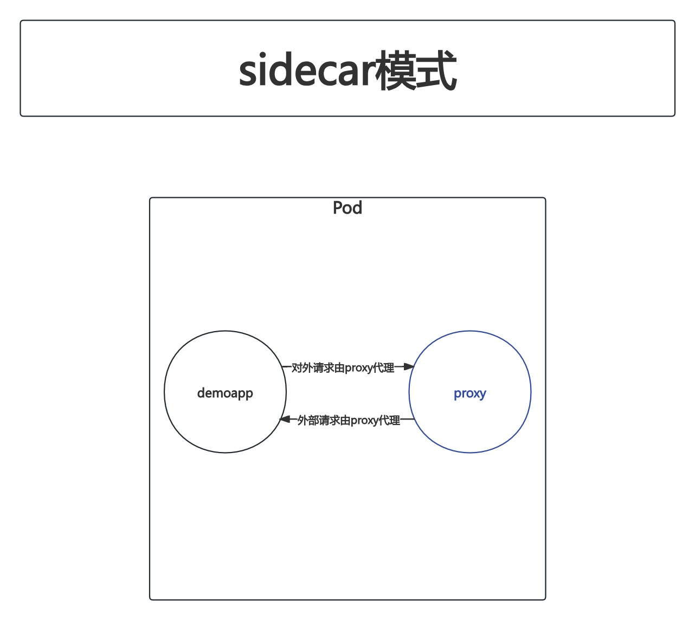
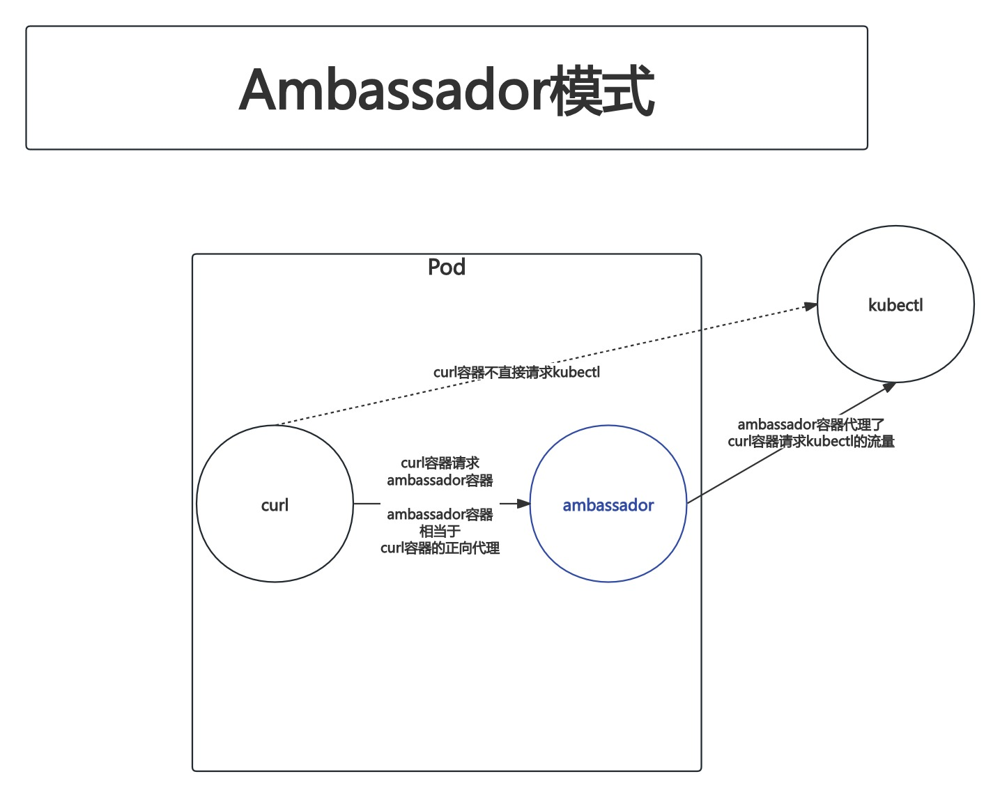
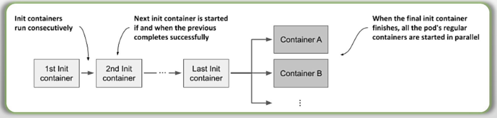
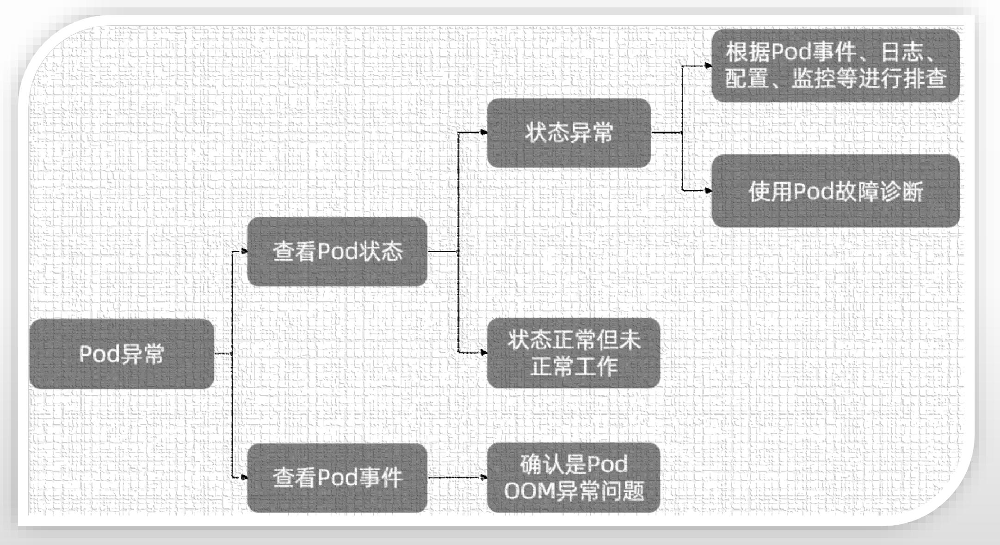
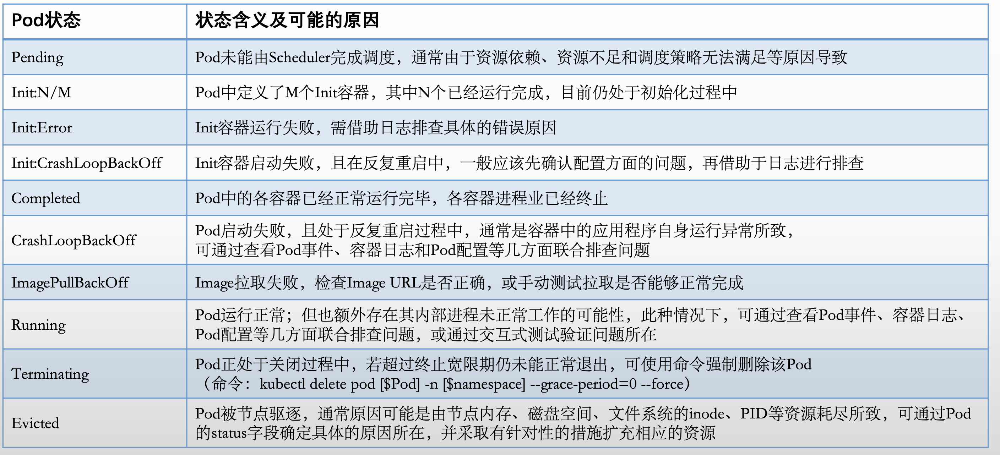
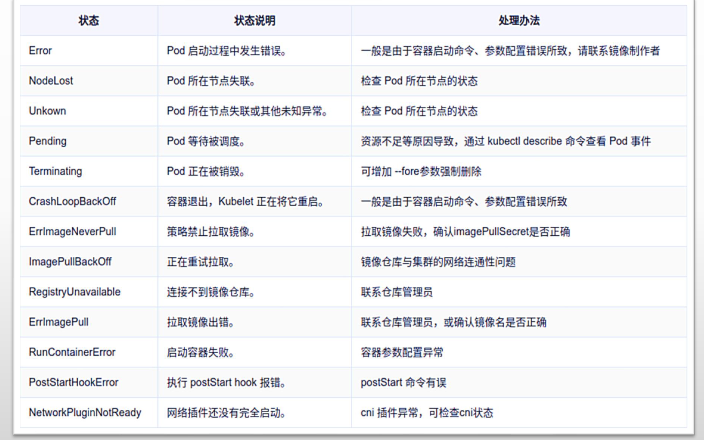

# PART6. Pod资源需求和设计模式

## 6.1 Pod的资源需求与限制

资源需求(requests):

- 定义需要系统预留给该容器使用的资源**最小可用值**
- 容器运行时可能用不到这些额度的资源,但用到时必须确保有相应数量的资源可用
- **资源需求的定义会影响调度器的决策**
- **资源需求的定义会影响到目标节点上计入自身可用资源和已分配资源的状态**

资源限制(limits):

- 定义该容器可以申请使用的资源**最大可用值**,超出该额度的资源使用请求将被拒绝
- 该限制需要大于等于requests的值,但系统在其某项资源紧张时,会从容器那里回收其使用的超出其requests值的那部分

requests和limits定义在容器级别,主要围绕cpu、memory和hugepages三种资源

资源需求是为容器设定的**预留资源空间**,是一种下限.资源需求告诉调度器要调度的目标节点至少要满足的条件

资源限制是为容器设定的**最大可用资源**,是一种上限.资源限制控制了一个容器最多能够使用的系统资源

### 6.1.1 CPU限制

资源控制在CPU方面,用**数字**表示控制容器所使用的**逻辑核心数**(也就是我们通常说的N核M线程中的M)

1 core = 1000m cores

0.1 core = 100m cores

这里的m表示毫核

举个例子:给某个容器分配了500m的CPU,该容器被调度到的节点上共有4个逻辑CPU.假定该容器跑满了.

那么,从操作系统的角度上来讲,这个容器(或者可以说是进程)可能会调度到任何一个逻辑CPU上,且很有可能是平均调度的.所以最终并不是某一个逻辑CPU上有一半的时间片被分配给了该进程,而是**该进程在4个逻辑CPU上总共分配到的时间片不超过0.5个逻辑CPU**.换言之,就是对于4个逻辑CPU而言,每个逻辑CPU有大约12.5%的时间片被分配给了该进程.

### 6.1.2 Memory限制

资源控制在内存方面就比较常规了:

- KiB: KB
- MiB: MB
- GiB: GB
- TiB: TB

### 6.1.3 可压缩型资源与不可压缩型资源

需要注意的是:**CPU是可压缩型资源,而内存是不可压缩型资源**

举个例子:假定我们给某个容器做如下限定:

- 定义其资源需求为100m的CPU
- 定义其资源限制为500m的CPU

假定该进程跑满消耗了300m的CPU.

当有其他进程需要消耗更多的CPU资源时,该进程消耗的CPU是可以再退回到100m的(只需要在后续的调度时少调度给该进程一些时间片即可).因此**CPU是可压缩型资源**

但内存就不一样了.假定我们给某个容器做如下限定:

- 定义其资源需求为100MiB的内存
- 定义其资源限制为500MiB的内存

假定该进程跑满消耗了500MiB的内存.

假定此时节点上的剩余可用内存不足以满足其他容器的资源需求时,是无法让该容器将超过资源需求的额外400MiB内存还给OS的.因为直接回收内存有可能会导致进程崩溃,所以**内存是不可压缩型资源**

因此,对于关键应用,**建议定义其内存的资源需求和内存的资源限制是相同的**.这样可以避免该容器超规使用,进而后续因为内存回收引发OOM问题,进而导致内存崩溃.

且在资源方面,使用的资源应该是整体水位的70%-80%之间,是一个比较合理的数字.

例如:整个集群计算后确认需要128核的逻辑CPU和2T内存,那么应该准备160核逻辑CPU和2.5T的内存.

## 6.2 资源需求与限制示例

### 6.2.1 资源需求示例

```
root@longinus-master-1:~/k8s-yaml# vim resource-requests-demo.yaml
root@longinus-master-1:~/k8s-yaml# cat resource-requests-demo.yaml
```

```yaml
apiVersion: v1
kind: Pod
metadata:
  name: stress-pod
  namespace: demo
spec:
  containers:
  - name: stress
    image: ikubernetes/stress-ng
    command: ["/usr/bin/stress-ng", "-c 1", "-m 1", "--metrics-brief"]
    resources:
      # 资源需求: 128MB内存 0.2核逻辑CPU
      requests:
        memory: "128Mi"
        cpu: "200m"
      # 资源限制: 512MB内存 0.4核逻辑CPU
      limits:
        memory: "512Mi"
        cpu: "400m"
```

```
root@longinus-master-1:~/k8s-yaml# kubectl get pods -n demo -o wide
NAME                                READY   STATUS    RESTARTS      AGE     IP            NODE              NOMINATED NODE   READINESS GATES
...
stress-pod                          1/1     Running   0             57s     10.244.2.29   longinus-node-2   <none>           <none>
```

注:`ikubernetes/stress-ng`该镜像用于压测,会不断消耗内存,直至耗尽为止.

### 6.2.2 资源需求示例

```
root@longinus-master-1:~/k8s-yaml# vim resource-limits-demo.yaml
root@longinus-master-1:~/k8s-yaml# cat resource-limits-demo.yaml
```

```yaml
apiVersion: v1
kind: Pod
metadata:
  name: memleak-pod
  namespace: demo
  labels:
    app: memleak
spec:
  containers:
  - name: simmemleak
    image: ikubernetes/simmemleak
    imagePullPolicy: IfNotPresent
    resources:
      # 资源需求 64MB内存 1个逻辑CPU
      requests:
        memory: "64Mi"
        cpu: "1"
      # 资源限制 64MB内存 1个逻辑CPU
      limits:
        memory: "64Mi"
        cpu: "1"
```

```
root@longinus-master-1:~/k8s-yaml# kubectl apply -f resource-limits-demo.yaml
pod/memleak-pod created
```

```
root@longinus-master-1:~/k8s-yaml# kubectl get pods memleak-pod -n demo -o wide
NAME          READY   STATUS             RESTARTS      AGE     IP            NODE              NOMINATED NODE   READINESS GATES
memleak-pod   0/1     CrashLoopBackOff   5 (72s ago)   4m27s   10.244.1.27   longinus-node-1   <none>           <none>
```

```
root@longinus-master-1:~/k8s-yaml# kubectl describe pod memleak-pod -n demo
...
    State:          Terminated
      Reason:       OOMKilled
      Exit Code:    137
      Started:      Fri, 16 Feb 2024 14:08:39 +0800
      Finished:     Fri, 16 Feb 2024 14:08:39 +0800
    Last State:     Terminated
      Reason:       OOMKilled
      Exit Code:    137
      Started:      Fri, 16 Feb 2024 14:08:11 +0800
      Finished:     Fri, 16 Feb 2024 14:08:11 +0800
    Ready:          False
    Restart Count:  3
    Limits:
      cpu:     1
      memory:  64Mi
    Requests:
      cpu:        1
      memory:     64Mi
    Environment:  <none>
    Mounts:
      /var/run/secrets/kubernetes.io/serviceaccount from kube-api-access-nptfw (ro)
...
```

可以看到,Pod在不断地因为OOMKilled(内存溢出)而导致重启.

## 6.3 Pod设计模式

这里所谓的Pod设计模式,是指基于Pod的分布式应用设计模式.

### 6.3.1 关于容器设计模式

基于容器的分布式系统中常用的3类设计模式:

- 单容器模式:单一容器形式运行的应用
	- 以不同进程的形式将分布式应用运行在1个容器中.很明显这样做就没什么意义了.因为你的单个容器只能在单个节点上运行,所以这样做仅仅是模拟出来了一个分布式的效果
- 单节点模式:由强耦合的多个容器协同共生
	- 也就是1个Pod中运行了多个容器,相当于在同一个主机上运行了多个容器.这样做也没什么意义,因为你的多个容器需要运行在同一个主机上,一旦这台主机宕机了,你的分布式效果也就没有了
	- 这里所谓的强耦合,举个例子:例如为你的应用配置一个正/反向代理的proxy,这种情况下proxy和你的进程属于强耦合
- 多节点模式:基于特定部署单元(Pod)实现分布式算法
	- 一个应用的多个不同分布式实例放在不同的主机上
	- 比如MySQL的主从分布式集群,就应该是多Pod的模式,每个Pod是MySQL集群中的一个节点

单节点多容器模式

- 一种跨容器的设计模式
- 目的是在单个节点之上同时运行多个**共生关系**的容器,因而容器管理系统需要由将这些容器作为一个原子单位进行统一调度
- Pod概念就是这个设计模式的实现之一

### 6.3.2 单节点多容器模式的常见实现

#### 6.3.2.1 Sidecar模式

- Pod中的应用由主应用程序(通常是基于HTTP协议的应用程序)以及一个Sidecar容器组成
- 辅助容器用于为主容器提供辅助服务以增强主容器的功能,是主应用程序是必不可少的一部分,但却未必非得运行为应用的一部分

现在已经几乎不加区分,都称为Sidecar模式了.Sidecar模式、Ambassador模式和Adapter模式都是描述Pod内的多个常规容器是以何种协同形式存在的.

Sidecar模式可以理解为:在1个Pod中定义了多个容器,其中有一个是主容器,另外一个容器叫边车(Sidecar)容器.Sidecar容器存在的目的是为了能够扩充主容器的能力,甚至主容器离开了Sidecar容器,功能都不算完整.

##### Sidecar模式示例

```
root@longinus-master-1:~/k8s-yaml# vim sidecar-container-demo.yaml
root@longinus-master-1:~/k8s-yaml# cat sidecar-container-demo.yaml
```

```yaml
apiVersion: v1
kind: Pod
metadata:
  name: sidecar-container-demo
  namespace: demo
spec:
  containers:
  # sidecar容器 代理主容器的全部流量
  - name: proxy
    image: envoyproxy/envoy-alpine:v1.14.1
  - name: demo
    image: ikubernetes/demoapp:v1.0
    imagePullPolicy: IfNotPresent
    env:
    - name: HOST
      value: "127.0.0.1"
    - name: PORT
      value: "8080"
```

```
root@longinus-master-1:~/k8s-yaml# kubectl apply -f sidecar-container-demo.yaml
pod/sidecar-container-demo created
root@longinus-master-1:~/k8s-yaml# kubectl get pods sidecar-container-demo -n demo -o wide
NAME                     READY   STATUS    RESTARTS   AGE   IP            NODE              NOMINATED NODE   READINESS GATES
sidecar-container-demo   2/2     Running   0          46s   10.244.1.28   longinus-node-1   <none>           <none>
```



#### 6.3.2.2 Ambassador模式

- Pod中的应用由主应用程序和一个Ambassador容器组成
- 辅助容器代表主容器发送网络请求至外部环境中,因此可以将其视作主容器应用的"大使"
- 应用场景:云原生应用程序需要诸如断路、路由、计量和监视等功能,但更新已有的应用程序或现有代码库以添加这些功能可能很困难,甚至难以实现,进程外代理便成了一种有效的解决方案

Ambassador模式是指:当Pod中的主容器,需要对接外部环境的服务,但主容器自身无法兼容外部服务的访问要求,且我们也不打算在主容器中开发这个兼容的功能.此时就可以将发送给外部服务的请求,代理给Ambassador容器,由Ambassador容器将请求发送给外部服务.因此,兼容外部服务的功能也就实现在Ambassador容器上了

Ambassador容器和Sidecar容器的区别在于:Ambassador容器仅代理发送至外部服务的请求,而Sidecar Proxy是代理全部流量的

就像国家之前派遣大使一样,派遣的大使仅负责与该国家的交往事务

##### Ambassador模式示例

```
root@longinus-master-1:~/k8s-yaml# vim ambassador-container-demo.yaml
root@longinus-master-1:~/k8s-yaml# cat ambassador-container-demo.yaml
```

```yaml
apiVersion: v1
kind: Pod
metadata:
  name: ambassador-container-demo
  namespace: demo
spec:
  containers:
  # 主容器
  - name: curl
    image: ikubernetes/admin-box:v1.2
    command: ["sleep", "999999"]
  # ambassador容器 作为主容器的正向代理 代理请求kubectl proxy的流量
  - name: ambassador
    image: bitnami/kubectl:latest
    command: ["/bin/sh","-c","kubectl proxy"]
    args:    
    # 传递给 kubectl proxy 的选项,若需要改变默认监听的tcp/8001端口,可以额外附加"--port=NUM"选项
    - --server="https://kubernetes.default.svc"
    - --certificate-authority="/var/run/secrets/kubernetes.io/serviceaccount/ca.crt"
    - --token="$(cat /var/run/secrets/kubernetes.io/serviceaccount/token)"
    - --accept-paths='^.\*'
```

```
root@longinus-master-1:~/k8s-yaml# kubectl apply -f ambassador-container-demo.yaml
pod/ambassador-container-demo created
root@longinus-master-1:~/k8s-yaml# kubectl get pods ambassador-container-demo -n demo -o wide
NAME                        READY   STATUS    RESTARTS   AGE   IP            NODE              NOMINATED NODE   READINESS GATES
ambassador-container-demo   2/2     Running   0          12s   10.244.2.32   longinus-node-2   <none>           <none>
```



#### 6.3.2.3 Adapter模式

- Pod中的应用由主应用程序和一个Adapter容器组成
- Adapter容器为主应用程序提供一致的接口,实现了模块重用,支持标准化和规范化主容器应用程序的输出以便于外部服务进行聚合

Adapter模式则与Ambassador模式恰好相反:当Pod中的主容器,需要对接外部环境的服务,但这个场景下是需要外部服务来请求Pod中的主容器.而此时Pod中的主容器不能兼容客户端的规格要求.这种情况下也是在主容器旁边再添加一个Adapter容器,外部服务的请求先到达这个Adapter容器,而Adapter容器再请求主容器.响应也是先由主容器响应Adapter容器,再由Adapter容器将该响应转换为兼容外部服务的格式,最终响应给给外部服务

Adapter容器和Sidecar容器的区别在于:Adapter容器仅代理响应给外部服务的请求,而Sidecar Proxy是代理全部流量的

相当于:Adapter模式是反向代理;而Ambassador模式是正向代理

```
root@longinus-master-1:~/k8s-yaml# vim adapter-container-demo.yaml
root@longinus-master-1:~/k8s-yaml# cat adapter-container-demo.yaml
```

```yaml
apiVersion: v1
kind: ConfigMap
metadata:
  name: nginx-conf
  namespace: demo
data:
  default.conf: |
    server {
      listen       80;
      server_name  localhost;
      location / {
          root   /usr/share/nginx/html;
          index  index.html index.htm;
      }
      error_page   500 502 503 504  /50x.html;
      location = /50x.html {
          root   /usr/share/nginx/html;
      }
      location /nginx_status {
        stub_status;
        allow 127.0.0.1; 
        deny all;   
      }
    }
---
apiVersion: v1
kind: Pod
metadata:
  name: adapter-container-demo
  namespace: demo
spec:
  containers:
  - name: nginx
    image: nginx:alpine
    ports:
    - containerPort: 80
    volumeMounts:
    - mountPath: /etc/nginx/conf.d/
      name: nginx-conf
      readOnly: true
  - name: adapter
    image: nginx/nginx-prometheus-exporter:latest
    args: ["-nginx.scrape-uri","http://localhost/nginx_status"]
    ports:      
    # nginx-prometheus-exporter默认监听tcp/9113端口
    - name: exporter
      containerPort: 9113   
  volumes:
  - name: nginx-conf
    configMap:
      name: nginx-conf
      items:
      - key: default.conf
        path: default.conf
```

```
root@longinus-master-1:~/k8s-yaml# kubectl apply -f adapter-container-demo.yaml
configmap/nginx-conf created
pod/adapter-container-demo created
root@longinus-master-1:~/k8s-yaml# kubectl get pods adapter-container-demo -n demo
NAME                     READY   STATUS    RESTARTS   AGE
adapter-container-demo   2/2     Running   0          68s
```


#### 6.3.2.4 Init Container模式

- 一个Pod中可以同时定义多个Init容器
- Init容器负责以不同于主容器的生命周期来完成那些必要的初始化任务,包括在文件系统上设置必要的特殊权限、数据库模式设置或为主应用程序提供初始数据等,但这些初始化逻辑无法包含在应用程序的镜像文件中.或者出于安全原因,应用程序镜像没有执行初始化活动的权限等等
- Init容器需要串行运行,且在所有Init容器均正常终止后,才能运行主容器



需要注意的是,`pods.spec.containers`字段用于定义常规容器,而初始化容器由其专属字段来定义,字段为`pods.spec.initContainers`

```
root@longinus-master-1:~/k8s-yaml# kubectl explain pods.spec.initContainers
KIND:       Pod
VERSION:    v1

FIELD: initContainers <[]Container>
...
```

## 6.4 Pod状态及常见异常问题

### 6.4.1 Pod异常问题排查的诊断流程



基本上看Pod事件就能看出来问题了

### 6.4.2 Pod常见状态及含义



### 6.4.3 Pod常见错误及处理办法

