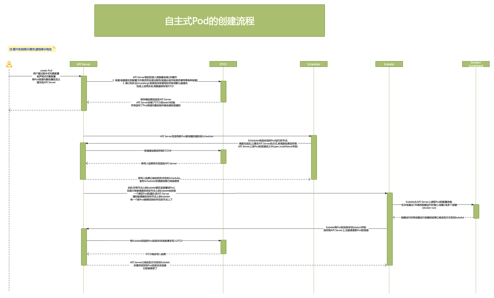
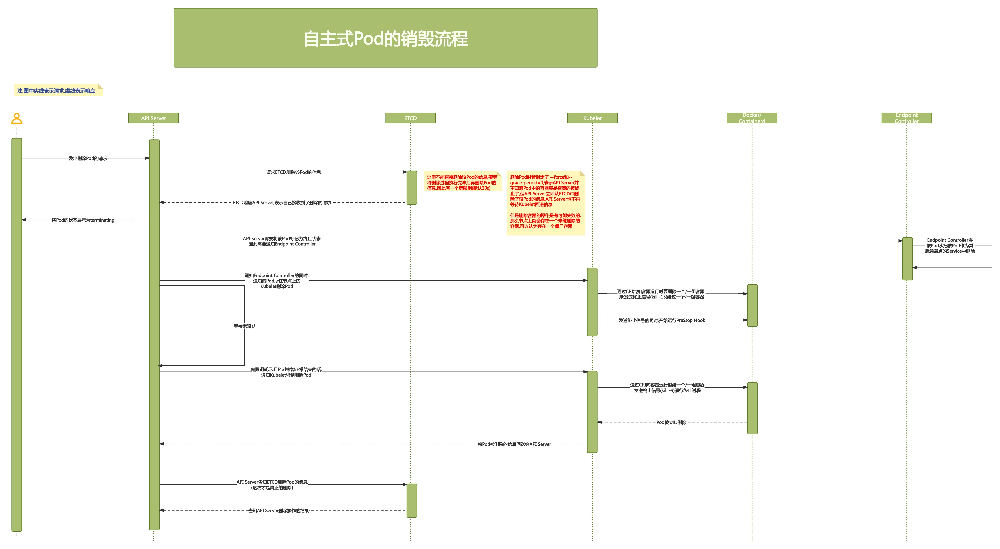

# PART1. 存储卷基础

## 1.1 Pod的创建和终止

### 1.1 自主式Pod的创建流程

Pod分为3种类型:

- 静态Pod:由kubelet自动扫描指定目录创建的Pod
- 动态Pod/托管式Pod:由工作负载型控制器基于Pod模板创建的Pod
- 自主式Pod:用户直接定义的Pod

迄今为止,我们创建的Pod都是自主式Pod.自主式Pod的缺陷在于:一旦Pod所在的节点宕机,那么这些Pod是无法基于模板再在其他节点上自动创建出来的.因此,K8S上运行的Pod都应该使用工作负载型控制器来管控

### 1.2 自主式Pod的销毁流程

16:00