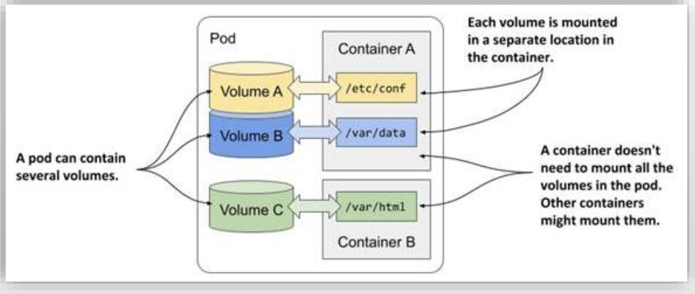
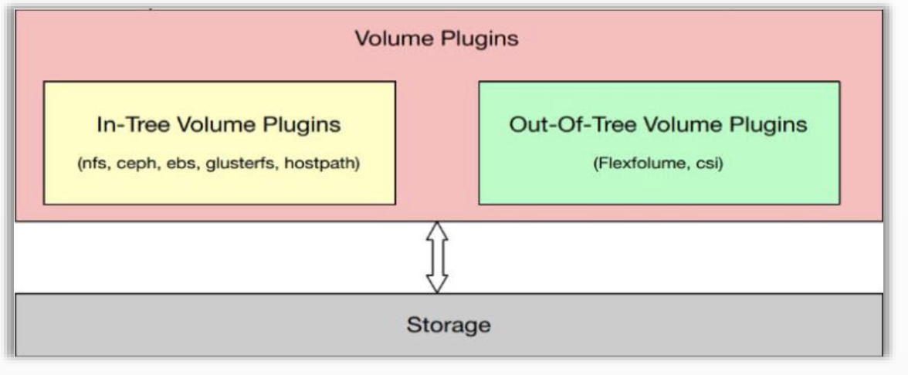

# PART1. 存储卷基础

## 1.1 Pod的创建和终止

### 1.1 自主式Pod的创建流程

Pod分为3种类型:

- 静态Pod:由kubelet自动扫描指定目录创建的Pod
- 动态Pod/托管式Pod:由工作负载型控制器基于Pod模板创建的Pod
- 自主式Pod:用户直接定义的Pod

迄今为止,我们创建的Pod都是自主式Pod.自主式Pod的缺陷在于:一旦Pod所在的节点宕机,那么这些Pod是无法基于模板再在其他节点上自动创建出来的.因此,K8S上运行的Pod都应该使用工作负载型控制器来管控


### 1.2 自主式Pod的销毁流程


## 1.2 存储卷基础

Pod由两部分组成:

- 容器集
- 存储卷

从概念上讲,存储卷是可供Pod中的所有容器访问的**目录**

Pod规范中声明的**存储卷来源(也就是卷背后实际的存储服务,例如NFS/Ceph)**决定了目录的创建方式、使用的存储介质以及目录的初始内容

- K8S为了能够连接到卷,要存储卷插件(存储驱动).存储卷插件决定了支持的后端存储介质或存储服务,例如hostPath插件使用宿主机文件系统,而nfs插件则对接指定的NFS存储服务等
- kubelet内置支持多种存储卷插件.**kubelet通过存储卷插件识别本地节点可以对接的远程驱动,并将远程驱动关联到容器内部使用**
- CSI用于对接第三方存储卷插件,但CSI并非必备.因为kubelet内置了一部分主流的存储卷插件.因此存储卷插件分为2类:
	- In-tree plugins(入栈插件):与 Kubernetes代码库一起维护和发布的插件
	- Out-of-tree plugins(出栈插件):这些插件允许存储提供商独立于Kubernetes核心代码库开发和维护其存储插件.最常见的出栈插件包括容器存储接口(CSI)插件

Pod在规范中需要指定其包含的卷以及这些卷在容器中的挂载路径

**存储卷对象并非Kubernetes系统一等公民**.就如同我们无法向API Server发出一个直接创建容器的请求,而是要向API Server发出一个创建Pod的请求一样,我们也无法向API Server发出一个直接创建存储卷的请求,还是要向API Server发出一个创建Pod的请求,因为卷是定义在Pod上的.因此**存储卷的生命周期与Pod相同**,这意味着:

- Pod中的所有存储卷都是在创建Pod时一并被创建
- 删除Pod时,其上的所有存储卷的定义也会同时被删除

注意:**这里所谓的存储卷的定义被删除,是指被删除的仅仅是存储卷的定义,而非是存储卷上的数据.存储卷上的数据仍旧被持久化了**.kubelet通过存储卷插件在Pod上定义一个存储卷,让这个存储卷连接远程存储.当你删除Pod时,也只是删除了这个存储卷的定义(类似于存储卷的名称之类的定义),而远程的存储空间依然存在.

因此下一次再定义Pod时,只要定义的存储卷关联的是同一个存储介质/存储空间/存储单元,那么数据就依然存在,但是存储卷有可能已经被定义成其他的名称了.**相当于存储卷是存储介质的一个逻辑抽象**.

另一方面,存储卷后端的存储及相关数据的生命周期通常要取决于**存储介质而非Pod的生命周期**

## 1.3 卷的使用方法

- 一个Pod可以附带多个卷,其每个容器可以在不同位置按需挂载Pod上的任意卷,或者不挂载任何卷
- Pod上的某个卷,也可以同时被该Pod内的多个容器同时挂载,以**共享数据**
	- 这里的共享数据是线程安全的.因为这些容器是在同一个内核上运行的,所以一个容器进行写操作,实际上就相当于一个进程进行写操作,持有了写锁,另外一个容器(也就是另外一个进程)是能看到的.因此不会产生争用的问题
- 如果支持,多个Pod也可以通过卷接口访问同一个后端存储单元
	- 如果远程存储服务是块级别的,那么在2个Pod访问同一个存储单元时,可能就会出现时间戳错乱的问题.这里我们以同一个宿主机上的2个进程访问同一个文件为例来解释.同一个书主机上的2个进程访问同一个文件,就像上文讲到的,互相之间能看到对方持有的锁;而2个Pod访问同一个块设备就不行,因为2个Pod分别使用的是各自宿主机的内核,互相看不到对方持有的锁.如果远程存储服务是文件系统级别,例如NFS,那么NFS有自己的内核,所有的读写请求都需要经过NFS内核的仲裁,因此不会发生时间戳错乱的问题.但如果远程存储服务是块级别,就不具备这个仲裁的能力了.
- 存储卷是定义在Pod上的,而非容器上的.因此Pod中的容器要想使用卷,必须先挂载卷



## 1.4 存储卷类型和相应的插件

每种存储卷类型都需要使用对应的卷插件类型来进行驱动

### 1.4.1 In-Tree存储卷插件

#### a. 临时存储卷

临时存储卷:Pod内的临时目录.随着Pod的删除卷也就没了,卷上存储的数据也就没了

- emptyDir

#### b. 节点本地存储卷

节点本地存储卷:在Pod所在的节点上提供的目录.这个目录就在Pod所在节点的磁盘上,没有关联任何远程存储.这就意味着如果Pod删除了,那么重建Pod时,必须调度到同一个节点上,才能访问到之前的数据.

- hostPath
- local

#### c. 网络存储卷

网络存储卷:存储空间不在节点本地,而是在远程的.

##### c1. 文件系统

大多数文件系统都是支持多路Pod同时访问的

- NFS
- GlusterFS(已废弃)
- CephFS
- Cinder(已废弃)

##### c2. 块设备

块设备一般不支持多Pod同时访问

- iSCSI
- FC
- RBD
- vSphereVolum

##### c3. 存储平台

- Quobyte
- PortworxVolume
- StorageOS
- ScaleIO

##### c4. 云存储

- awsElasticBlockStore
- gcePersistentDisk
- azureDisk
- azureFile

#### d. 特殊存储卷

- Secret
- ConfigMap
- DownwardAPI
- Projected

### 1.4.2 Out-Tree存储卷插件

经由CSI或FlexVolume接口扩展出的存储系统称为Out-Tree类的存储插件

每个节点上都有kubelet,这也就意味着,如果要对接第三方存储卷插件,就必须在每个节点上都部署这个第三方存储卷插件.通常CSI会在每个节点上部署一个DaemonSet,该DaemonSet的Pod中提供了卷插件.而kubelet也需要借助这个Pod,才能给其他Pod提供通过CSI卷插件去访问第三方存储服务的能力.



## 1.5 存储卷资源规范

### 1.5.1 定义存储卷

- 存储卷对象并非Kubernetes系统一等公民,它需要定义在Pod上
- 存储卷本身的生命周期和Pod相同,但其后端的存储及相关数据的生命周期通常要取决于存储介质

### 1.5.2 存储卷的配置

存储卷的配置由两部分组成:

- 通过`.spec.volumes`字段定义在Pod之上的存储卷列表,它经由特定的存储卷插件并结合特定的存储供给方的访问接口进行定义
- 嵌套定义在容器的`volumeMounts`字段上的存储卷挂载列表,它只能挂载当前Pod对象中定义的存储卷

```yaml
spec:
  volumes:
  # 卷名称标识,仅可使用DNS标签格式的字符,在当前Pod中必须惟一
  - name: <string>
  # 存储卷插件及具体的目标存储供给方的相关配置 VOL_TYPE表示具体卷插件的名称
  VOL_TYPE: <Object>
  containers:
  - name: …
    image: …
    volumeMounts:
      # 要挂载的存储卷的名称,必须匹配存储卷列表中某项的定义
    - name: <string>
      # 容器文件系统上的挂载点路径
      mountPath: <string>
      # 是否挂载为只读模式,默认为否
      readOnly: <boolean>
      # 挂载存储卷上的一个子目录至指定的挂载点
      subPath: <string>
      # 挂载由指定的模式匹配到的存储卷的文件或目录至挂载点
      subPathExpr: <string>
      # 挂载卷的传播模式
      mountPropagation: <string>
```