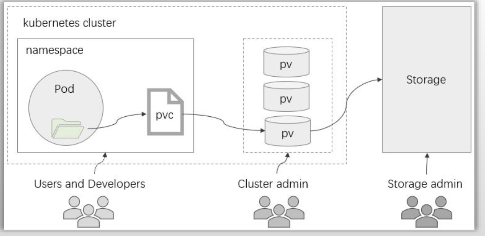
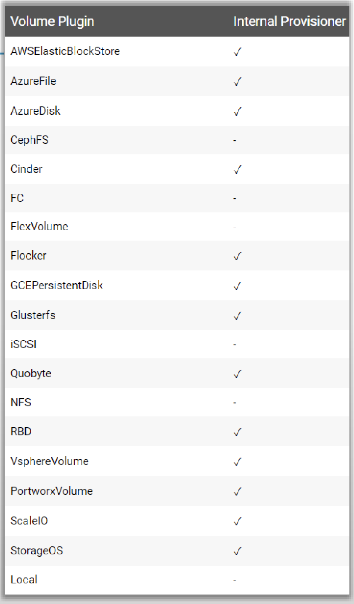

# PART3. PV、PVC和StorageClass

## 3.1 简介

在Pod级别定义存储卷有两个弊端:

- 卷对象的生命周期无法独立于Pod而存在
- 用户必须要足够熟悉可用的存储及其详情才能在Pod上配置和使用卷

换言之,**Pod与后端存储细节的耦合度过高**.而PV和PVC可用于降低这种耦合关系:

- PV(Persistent Volume):是**集群级别**的资源,负责将存储空间引入到集群中,通常**由管理员定义**
	- PV定义了存储的细节,例如存储的服务器、存储的认证、存储设备的类型(文件系统/块设备).而这些信息通常只让存储的管理员知道即可.这些信息既不该暴露给普通用户(出于安全考虑),普通用户也并不关心(用户只是想要存储,他们并不关心存储拓扑)
- PVC(Persistent Volume Claim)是**名称空间级别**的资源,**由用户定义**,用于在空闲的PV中申请使用符合过滤条件的PV之一,**与选定的PV是"一对一"的关系**
	- 通常对于存储的使用者而言,他们也只关心两件事:1. 要使用多大的空间;2. 要使用文件系统还是块设备.因此其他的存储细节并不应该暴露给用户,用户也并不关心
- 用户在Pod上通过**pvc插件**请求绑定使用定义好的PVC资源

StorageClass资源支持PV的动态预配(Provision)

K8S中的PV Controller负责检查用户通过PVC声明的需求并检查已有的PV,找一个最接近PVC声明需求的PV,将二者建立映射关系.如果没有能满足条件的PV,则PVC也处于Pending状态.

注:这里的检查,既要检查大小,还要检查存储设备的类型.这两个条件是逻辑与关系.

用户在Pod上,也只需要引用PVC即可.



K8S将一件事分成了好几个阶段,每个阶段由不同的角色来完成,中间使用PV Controller自动桥接二者:

- 管理员创建PV
- 用户声明PVC
- Pod使用PVC

因此Pod上使用的插件类型也变成了pvc插件.

但仍然存在一个问题:当没有PV能够满足用户声明的PVC时,PVC就会处于Pending状态.**很明显这不够自动化**.

由此引出了PV的动态预配和StorageClass:

- 静态置备(Provision)的PV:事先创建好等待PVC来绑定的PV
- 动态置备的PV:事前不创建任何一个PV,而是创建一个PV的模板,对接后端存储的细节都在这个模板中指定了.该模板用于对接**后端存储的管理API接口(注意这个模板并非直接对接后端存储的存储单元)**.每当有一个PVC的绑定请求到来时,按需请求后端存储的API,创建存储单元.然后将这个存储单元按需动态地创建成PV,以便让PVC来绑定.而这个模板,在K8S中称为StorageClass
	- 注意:并非所有的存储服务都自带这种管理的API接口.例如NFS就不支持,因此想要基于NFS创建动态置备的PV是无法实现的

StorageClass:**集群级别**资源.通常**由管理员定义**

## 3.2 PV资源

PV是标准的资源类型,除了负责关联至后端存储系统(因为要关联存储系统,所以要在PV上定义存储插件.相当于把定义存储插件的能力从用户手中拿到管理员手中了)外,它通常还需要定义支持的存储特性(为了让PV Controller能够根据用户声明的PVC进行筛选):

- Volume Mode:当前PV卷提供的存储空间模型,分为**块设备**和**文件系统**两种
- StorageClassName:当前PV隶属的存储类
- AccessMode:支持的访问模型,分为单路读写(RWO)、多路读写(RWX)、多路只读(ROX)、单Pod单路读写(RWOP),共4种.访问模型决定了是否支持多路Pod同时挂载
	- 单Pod单路读写:只允许1个Pod同时挂载
	- 单路读写:允许多个Pod同时挂载,但只允许1个Pod同时写入
- Size:当前PV允许使用的空间上限

SC除了在动态置备PV时当做模板使用外,在静态置备PV时也可以作为PV的分组使用

举个例子来说明.假设我们的K8S集群外有2套存储系统:NFS和Ceph(假设我们使用的是Ceph的RBD块设备,RBD性能较好).那么我们进一步假设:所有关联到NFS的PV,性能稍差,但是支持多路Pod同时挂载;所有关联到CephRBD的PV,性能较好,但是不支持多路同时挂载.这时我们就可以定义2个SC:

- 一个名为fast,表示快速存储.对应CephRBD
- 一个名为medium,表示速度一般的存储.对应NFS

那么如果未来用户的需求是需要支持多路Pod同时挂载,则向名为medium的SC请求;否则向名为fast的SC请求.在这个场景下,**SC虽然没有起到模板的作用,但是被当做了特性分组的名称来使用**.但是如果PV没有定义SC,那么某个PVC如果想要绑定到该PV上,则该PVC也不能定义SC.换言之,**双方要么都属于某个SC,要么都不属于任何一个SC**.

在对象元数据上,还能够根据需要定义标签.后续PVC可以通过标签来筛选PV

一般需要定义回收策略:

- Retain:PVC删除后,仍旧保留PV,数据和存储单元都保留
- Recycle:PVC删除后,PV要回收,也就是删除PV上的数据但保留存储单元(已废弃)
- Delete:PVC删除后,PV也删除,也就是把数据和存储单元都删除

为了数据安全起见,通常应该使用Retain;最不应该使用的是Recycle.因为Recycle策略有可能导致回收的PV再供给别人使用时,别人将数据恢复回来,那就麻烦了.虽然Delete策略也会导致数据误删,但至少不会让别人能够恢复你的数据.

## 3.3 PVC

PVC也是标准的资源类型,它允许用户按需指定期望的存储特性,并以之为条件,按特定的条件顺序进行PV过滤

条件顺序为:

VolumeMode -> LabelSelector -> StorageClassName -> AccessMode -> Size

如果最终有多个PV符合条件,则从中挑选最佳适配;如果最佳适配还是有多个,那么就从中随机挑选一个

支持动态预配的存储类,还可以根据PVC的条件按需完成PV创建

## 3.4 基于NFS的静态PV和PVC示例

### 3.4.1 定义PV

```
root@longinus-master-1:~/k8s-yaml/day3# vim pv-nfs-demo.yaml
root@longinus-master-1:~/k8s-yaml/day3# cat pv-nfs-demo.yaml
```

```yaml
apiVersion: v1
kind: PersistentVolume
metadata:
  # PV的名称
  name: pv-nfs-demo
  # PV是集群级别资源 不需要定义namespace
spec:
  capacity:
    # 定义存储空间上限
    storage: 5Gi
  # 定义存储空间模型为文件系统
  volumeMode: Filesystem
  # 定义访问模型
  accessModes:
  # 定义访问模型为多路读写
  - ReadWriteMany
  # 支持多路读写则必然支持单路读写
  - ReadWriteOnce
  # 支持多路读写则必然支持多路只读
  - ReadOnlyMany
  # 定义回收策略为删除PVC后保留PV不动
  persistentVolumeReclaimPolicy: Retain
  # NFS文件系统独有的配置
  mountOptions:
  - hard
  - nfsvers=4.1
  # PV使用的存储插件
  nfs:
    # 定义存储细节
    path:  "/data/redis02"
    server: 192.168.1.60
```

```
root@longinus-master-1:~/k8s-yaml/day3# kubectl apply -f pv-nfs-demo.yaml
persistentvolume/pv-nfs-demo created
root@longinus-master-1:~/k8s-yaml/day3# kubectl get pv pv-nfs-demo -o wide
NAME          CAPACITY   ACCESS MODES   RECLAIM POLICY   STATUS      CLAIM   STORAGECLASS   REASON   AGE   VOLUMEMODE
pv-nfs-demo   5Gi        RWO,ROX,RWX    Retain           Available                                   12s   Filesystem
```

STATUS列值为Available,表示该PV目前没有被任何PVC绑定,处于可以被绑定的状态

CLAIM列显示绑定该PV的PVC的名字,目前没有任何PVC绑定了该PV,故显示空值

STORAGECLASS列表示定义的存储类

### 3.4.2 声明PVC

```
root@longinus-master-1:~/k8s-yaml/day3# vim pvc-demo.yaml
root@longinus-master-1:~/k8s-yaml/day3# cat pvc-demo.yaml
```

```yaml
apiVersion: v1
kind: PersistentVolumeClaim
metadata:
  name: pvc-demo
  # PVC是名称空间级别的资源 可以定义namespace
  namespace: demo
spec:
  # 定义期望对端的访问模式
  accessModes: 
  # 定义期望对端的访问模式为多路读写
  - "ReadWriteMany"
  # 定义期望对端的访问模式为单路读写
  - "ReadWriteOnce"
  # 定义期望对端的访问模式为多路只读
  - "ReadOnlyMany"
  # 定义期望对端的存储模型为文件系统
  volumeMode: Filesystem
  # 定义期望对端的空间大小
  resources:
    # 定义期望对端的空间大小至少为3G
    requests:
      storage: 3Gi
    # 定义期望对端的空间大小至多为10G
    limits:
      storage: 10Gi
```

```
root@longinus-master-1:~/k8s-yaml/day3# kubectl apply -f pvc-demo.yaml
persistentvolumeclaim/pvc-demo created
root@longinus-master-1:~/k8s-yaml/day3# kubectl get pvc pvc-demo -n demo -o wide
NAME       STATUS   VOLUME        CAPACITY   ACCESS MODES   STORAGECLASS   AGE   VOLUMEMODE
pvc-demo   Bound    pv-nfs-demo   5Gi        RWO,ROX,RWX                   10s   Filesystem
```

- 其中STATUS列值为Bound,表示该PVC已经被绑定
- VOLUME列值为pv-nfs-demo,表示该PVC绑定的PV名称为pv-nfs-demo
- CAPACITY列值为5Gi,表示空间大小,PVC请求的空间大小为3G-10G,最终选定了一个5G的PV

再次查看PV的状态:

```
root@longinus-master-1:~/k8s-yaml/day3# kubectl get pv pv-nfs-demo -o wide
NAME          CAPACITY   ACCESS MODES   RECLAIM POLICY   STATUS   CLAIM           STORAGECLASS   REASON   AGE   VOLUMEMODE
pv-nfs-demo   5Gi        RWO,ROX,RWX    Retain           Bound    demo/pvc-demo                           19m   Filesystem
```

可以看到,此时的STATUS列值为Bound,表示已经被PVC绑定了.且CLAIM列也显示了绑定该PV的PVC的名称

此时如果再创建一个PVC,那么就无法找到满足条件的PV了,因此该PVC会一直处于Pending状态

```
root@longinus-master-1:~/k8s-yaml/day3# cp ./pvc-demo.yaml pvc-demo-02.yaml 
root@longinus-master-1:~/k8s-yaml/day3# kubectl apply -f pvc-demo-02.yaml
persistentvolumeclaim/pvc-demo-02 created
root@longinus-master-1:~/k8s-yaml/day3# kubectl get pvc pvc-demo-02 -n demo -o wide
NAME          STATUS    VOLUME   CAPACITY   ACCESS MODES   STORAGECLASS   AGE   VOLUMEMODE
pvc-demo-02   Pending                                                     14s   Filesystem
```

### 3.4.3 创建Pod,消费存储

```
root@longinus-master-1:~/k8s-yaml/day3# vim pod-with-pvc-demo.yaml
root@longinus-master-1:~/k8s-yaml/day3# cat pod-with-pvc-demo.yaml
```

```yaml
apiVersion: v1
kind: Pod
metadata:
  name: pod-with-pvc-demo
  namespace: demo
spec:
  volumes:
    # 存储卷名称
  - name: redis-pvc-vol
    # 指明存储卷插件类型为PVC插件
    persistentVolumeClaim:
      # 指明要使用的PVC的名称
      claimName: pvc-demo
  containers:
  - name: redis
    image: redis:7-alpine
    imagePullPolicy: IfNotPresent
    ports:
    - containerPort: 6379
      name: redisport
    # 容器内的挂载点列表
    volumeMounts:
    - mountPath: /data
      name: redis-pvc-vol
```

```  
root@longinus-master-1:~/k8s-yaml/day3# kubectl apply -f pod-with-pvc-demo.yaml
pod/pod-with-pvc-demo created
root@longinus-master-1:~/k8s-yaml/day3# kubectl get pods pod-with-pvc-demo -n demo -o wide
NAME                READY   STATUS    RESTARTS   AGE   IP            NODE              NOMINATED NODE   READINESS GATES
pod-with-pvc-demo   1/1     Running   0          12s   10.244.2.41   longinus-node-2   <none>           <none>
```

整件事的本质没变,还是使用NFS存储Pod的数据.但对于用户而言,只需要做2件事:

1. 创建PVC,声明自己要使用的空间大小、存储空间模型和访问模型即可
2. 在Pod上指明要使用的PVC

而存储细节交给管理员通过PV进行定义即可.这种存储架构也被称为生产消费式的存储架构.由PV负责生产,Pod负责消费.

## 3.4 StorageClass

StorageClass资源是K8S支持的标准资源类型之一,是为了管理PV资源而按需创建的存储资源类别(逻辑组).是PVC筛选PV时的一个过滤条件,同时也为动态创建PV提供了"模板"的功能.



Provisioner是专门用于帮助SC从远程存储服务的管理API上动态准备存储单元并创建PV的一个**管理程序**.这个程序由存储服务提供,如果存储服务没有提供,则该存储服务不具备动态置备PV的能力.

这里由于NFS不支持Internel Provisioner,所以无法演示动态置备PV的功能.但是通过CSI扩展第三方存储服务后,同样也能动态置备PV.且这种方式才是在生产中使用最多的方式.

虽然NFS自身不支持Internel Provisioner,但实际上它只是需要一个管理程序,因此给NFS扩展一个External Provisioner,就可以使NFS具备动态置备PV的能力了.将这个External Provisioner通过CSI对接到K8S上就可以了.

另外一个比较奇怪的地方是:虽然CephFS不支持Internel Provisioner,但是CephRBD确支持Internel Provisioner.

StorageClass资源示例:

```yaml
apiVersion: storage.k8s.io/v1
kind: StorageClass
metadata:
  name: nfs-csi
  # SC同样是集群级别的 不需定义namespace
# SC如果作为模板使用 要明确指定SC的provisioner
# SC如果只是作为PV的逻辑组使用 则这个字段写空值(不写任何内容但需要这个字段)即可
provisioner: nfs.csi.k8s.io
# SC如果作为模板使用 则SC同样需要对接存储细节 这个字段用于定义存储细节
parameters:
  server: nfs-server.nfs.svc.cluster.local
  share: /
# 动态置备的PV的默认回收策略
reclaimPolicy: Retain
# 卷绑定模式 
# Immediate: 当声明了一个PVC,并向该SC请求动态置备PV时,无论是否有Pod使用该PVC进行存储,SC都立即置备PV并绑定到该PVC
# WaitForFirstConsumer: 当有Pod第一次使用该PVC进行存储时,SC再进行动态置备PV并绑定到该PVC
volumeBindingMode: Immediate
# 使用NFS时的独有选项
mountOptions:
  - hard
  - nfsvers=4.1
```